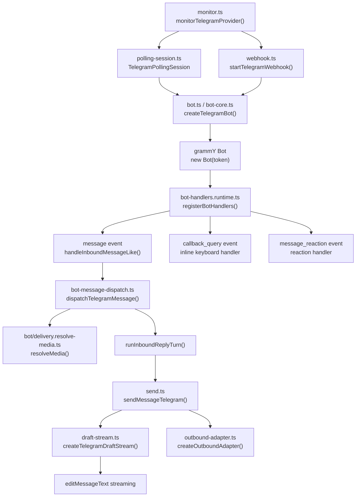
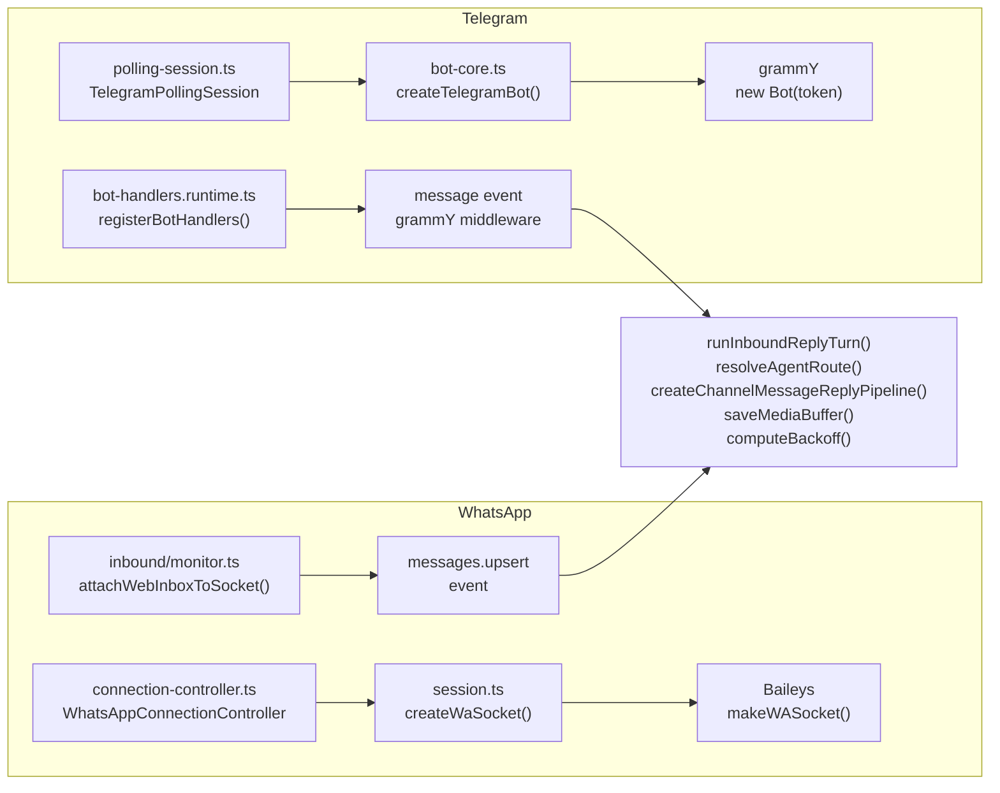

# DeepWiki Q&A with Code Context for Repository: openclaw/openclaw
## Q3
now allow for shared functionality between a same level of depth for telegram integration as well from establishing connection to replying to events, streaming and more in telegram integration and explore all the shared commonalities between whatsapp + telegram after explaining a great deal about the telegram entire integration
### Answer
Let me explore the telegram extension directory structure and read the key files in parallel to get a comprehensive understanding of the Telegram integration.

I now have enough information to write a comprehensive code tour of the Telegram integration and then compare it with WhatsApp. Let me synthesize everything I've gathered.

**Telegram integration key files:**

1. **`bot-core.ts`** / **`bot.ts`** - `createTelegramBotCore` / `createTelegramBot` - creates a grammY `Bot` instance, installs throttler, sequentializer, error handler, update tracker
2. **`monitor.ts`** - `monitorTelegramProvider` - top-level orchestrator, creates `TelegramPollingSession` or starts webhook
3. **`polling-session.ts`** - `TelegramPollingSession` - manages the grammY runner lifecycle, watchdog, stall detection, reconnect
4. **`webhook.ts`** - `startTelegramWebhook` - alternative to polling, HTTP server that receives updates from Telegram
5. **`bot-handlers.runtime.ts`** - registers all grammY event handlers: `message`, `channel_post`, `message_reaction`, `callback_query`, etc.
6. **`bot-message-dispatch.ts`** - `dispatchTelegramMessage` - builds context, calls `runInboundReplyTurn`
7. **`bot-message-context.ts`** - builds the `ctxPayload` (inbound context for the AI)
8. **`bot/delivery.resolve-media.ts`** - `resolveMedia` - downloads inbound media via `getFile` + HTTP fetch
9. **`send.ts`** - `sendMessageTelegram`, `sendTypingTelegram`, `reactMessageTelegram`, `editMessageTelegram`, `sendPollTelegram`
10. **`outbound-adapter.ts`** - `createTelegramOutboundAdapter` - `ChannelOutboundAdapter` implementation
11. **`draft-stream.ts`** - `createTelegramDraftStream` - streaming via `sendMessage` + `editMessageText`
12. **`dm-access.ts`** / **`group-access.ts`** - access control
13. **`bot/delivery.replies.ts`** - `deliverMediaReply` - sends media replies

**Key differences from WhatsApp:**
- Transport: Telegram uses Bot API (HTTP polling or webhook) vs WhatsApp uses WebSocket (Baileys)
- Auth: Telegram uses a bot token vs WhatsApp uses QR-code linked device
- Connection: Telegram uses grammY runner vs WhatsApp uses Baileys socket
- Streaming: Telegram supports `sendMessage` + `editMessageText` streaming; WhatsApp doesn't have native streaming
- Media download: Telegram uses `getFile` + HTTP download vs WhatsApp uses `downloadMediaMessage` from Baileys
- Reconnect: Telegram has polling stall watchdog + grammY runner retry vs WhatsApp has `WhatsAppConnectionController` with WebSocket reconnect
- Sequentialization: Telegram uses grammY `sequentialize` middleware per chat/thread; WhatsApp uses debouncer per sender
- Reactions: Telegram has `message_reaction` events; WhatsApp uses `ackReaction` (emoji sent by bot)
- Forum topics: Telegram has `message_thread_id` for forum topics; WhatsApp has groups only
- Inline keyboards: Telegram has `callback_query` for button interactions; WhatsApp doesn't have this

**Shared infrastructure:**
- `runInboundReplyTurn` - used by both (and Discord, Slack, Signal, iMessage)
- `resolveAgentRoute` - used by both
- `createChannelMessageReplyPipeline` - used by both
- `computeBackoff` / `sleepWithAbort` - used by both for reconnect/retry
- `saveMediaBuffer` - used by both for inbound media storage
- `ChannelOutboundAdapter` interface - both implement it
- `dmPolicy` / `allowFrom` / `groupPolicy` access control patterns - both use them
- `pairing` system - both support it
- `historyLimit` / group history - both support it
- `resolveMarkdownTableMode` - both use it
- `recordChannelActivity` - both use it

Let me now write the comprehensive answer.


Here is a complete code tour of the Telegram integration, followed by a deep comparison with WhatsApp.

---

## Telegram integration — complete code tour

### Architecture overview



---

### 1. Bot construction — `bot-core.ts` / `bot.ts`

`createTelegramBotCore` is the factory for every grammY `Bot` instance. It:

1. Constructs `new Bot(token, { client, botInfo })` — the grammY client wraps the Telegram Bot API openclaw:352-361 
2. Installs a **per-token throttler** via `getOrCreateAccountThrottler(token, apiThrottler)` — reused across restarts for the same token openclaw:357-357 
3. Installs a **sequentializer** via grammY's `sequentialize` middleware, keyed by `chatId:threadId` — ensures messages in the same topic are processed in order, but `/status` bypasses the queue openclaw:351-356 
4. Creates an **update tracker** (`createTelegramUpdateTracker`) with `ackPolicy: "after_agent_dispatch"` — persists the watermark only after the agent has dispatched, so crashes don't lose updates openclaw:363-381 
5. Registers all event handlers via `registerBotHandlers` (from `bot-handlers.runtime.ts`)

---

### 2. Top-level orchestrator — `monitor.ts`

`monitorTelegramProvider` is the entry point for the running gateway. It:

1. Resolves the account config and bot token
2. Acquires a **polling lease** (`acquireTelegramPollingLease`) — prevents duplicate pollers for the same token openclaw:172-184 
3. Reads the persisted update offset from disk (`readTelegramUpdateOffset`) and creates a `persistUpdateId` callback that writes it atomically after each dispatched update openclaw:203-235 
4. Resolves the Telegram transport (proxy-aware fetch) via `resolveTelegramTransport` openclaw:239-243 
5. Creates a `TelegramPollingSession` and calls `runUntilAbort()` openclaw:245-262 

Runner options configure grammY's concurrency sink and `allowed_updates` (includes `message_reaction`): openclaw:28-47 

---

### 3. Polling session — `polling-session.ts`

`TelegramPollingSession` manages the grammY runner lifecycle. It is the Telegram equivalent of `WhatsAppConnectionController`.

**Restart policy:**
```
initialMs: 2000, maxMs: 30s, factor: 1.8, jitter: 25%
``` openclaw:19-24 

**Each polling cycle (`#runPollingCycle`):**
1. Installs an API middleware that intercepts `getUpdates` calls to track liveness openclaw:240-263 
2. Calls `run(bot, runnerOptions)` from `@grammyjs/runner` — this starts the long-poll loop openclaw:265-266 
3. Runs a **polling stall watchdog** (default 120s threshold, checked every 30s) — if `getUpdates` hasn't completed in that window, it force-stops the runner and starts a new cycle openclaw:26-29 

**Webhook cleanup:** Before polling starts, `deleteWebhook` is called to clear any previously registered webhook. Recoverable network errors during cleanup are tolerated. openclaw:209-234 

---

### 4. Webhook mode — `webhook.ts`

Alternative to polling. `startTelegramWebhook` starts an HTTP server (default `127.0.0.1:8787`), calls `bot.api.setWebhook(url, { secret_token })`, and routes incoming POST requests to `bot.handleUpdate(update)`. Updates are processed asynchronously through the same per-chat/per-topic bot lanes as polling.

---

### 5. Event handlers — `bot-handlers.runtime.ts`

This is the largest file in the Telegram extension. It registers all grammY event handlers:

| Handler | Event | What it does |
|---|---|---|
| `bot.on("message")` | Any message | Main inbound handler; skips bot's own echoes |
| `bot.on("channel_post")` | Channel posts | Synthesizes a `from` field, routes as group |
| `bot.on("message_reaction")` | Emoji reactions | Enqueues a system event to the agent session |
| `bot.on("callback_query")` | Inline button taps | Handles model selection, native commands, pairing |
| `bot.on("message:migrate_to_chat_id")` | Group→supergroup | Migrates group config in `openclaw.json` |

**`handleInboundMessageLike`** is the shared gate for `message` and `channel_post`:
1. Calls `resolveTelegramEventAuthorizationContext` — resolves `dmPolicy`, `groupConfig`, `topicConfig`, `resolvedThreadId`
2. Calls `resolveTelegramDmAllow` — checks allowlist/pairing
3. Calls `shouldSkipGroupMessage` — enforces `requireMention`, `groupPolicy`, `groupAllowFrom`
4. Records the message in the reply-chain cache
5. Calls `processInboundMessage` openclaw:1931-2017 

**Text fragment buffering:** Consecutive short text messages from the same sender within a tight time window are buffered and flushed as a single combined message (Telegram equivalent of WhatsApp's debouncer). openclaw:1088-1146 

**Media group buffering:** Telegram albums (`media_group_id`) are buffered for `mediaGroupFlushMs` (default 500ms) and dispatched as one inbound message. openclaw:1148-1178 

---

### 6. Inbound media download — `bot/delivery.resolve-media.ts`

`resolveMedia` is the Telegram equivalent of `downloadInboundMedia` in WhatsApp.

**Flow:**
1. Checks for sticker → `resolveStickerMedia` (handles static WEBP only; skips animated/video stickers)
2. Resolves file metadata from the message: `photo`, `video`, `video_note`, `document`, `audio`, `voice`
3. Calls `resolveTelegramFileWithRetry` → `ctx.getFile()` with 3 retries (1–4s backoff) openclaw:112-141 
4. Calls `downloadAndSaveTelegramFile` → builds URL `${apiBase}/file/bot${token}/${file_path}` → `fetchRemoteMedia` with SSRF policy → `saveMediaBuffer` openclaw:188-253 
5. Returns `{ path, contentType, placeholder }` where placeholder is e.g. `<media:audio>`, `<media:sticker>`

Media types supported: photo, video, video_note, document, audio, voice, sticker (static WEBP), animation (GIF). openclaw:89-110 

---

### 7. Message dispatch — `bot-message-dispatch.ts`

`dispatchTelegramMessage` builds the full inbound context and calls `runInboundReplyTurn`:

1. Creates `createChannelMessageReplyPipeline` (shared with WhatsApp, Discord, etc.)
2. Calls `runInboundReplyTurn` with a `resolveTurn` adapter that calls `dispatchReplyWithBufferedBlockDispatcher` openclaw:992-1016 
3. The `deliver` callback inside the dispatcher handles lane segmentation (reasoning vs answer), inline keyboard buttons, streaming draft updates, and final delivery

---

### 8. Streaming — `draft-stream.ts`

`createTelegramDraftStream` implements live streaming via `sendMessage` + `editMessageText`:

- **`partial` mode**: sends a preview message, then edits it as new text arrives
- **`block` mode**: appends chunks
- **`progress` mode**: keeps a separate status draft for tool progress, sends final answer as a new message

When the preview message exceeds 4096 chars, it is superseded: the current preview is retained and a new message is started. openclaw:173-224 

The `sendOrEditStreamMessage` function handles deduplication (skips if rendered text is unchanged), minimum initial char threshold, and error recovery. openclaw:226-308 

---

### 9. Outbound send — `send.ts`

`sendMessageTelegram` is the main outbound function. Media type dispatch:

| MIME | API call |
|---|---|
| `image/*` (non-GIF) | `api.sendPhoto` |
| GIF / animation | `api.sendAnimation` |
| `video/*` | `api.sendVideo` or `api.sendVideoNote` |
| `audio/*` (voice) | `api.sendVoice` |
| `audio/*` (non-voice) | `api.sendAudio` |
| anything else | `api.sendDocument` | openclaw:869-955 

Other send functions:
- `sendTypingTelegram` → `api.sendChatAction(chatId, "typing")` openclaw:989-1019 
- `reactMessageTelegram` → `api.setMessageReaction(chatId, messageId, reactions)` openclaw:1022-1065 
- `editMessageTelegram` → `api.editMessageText` with HTML parse mode + plain text fallback openclaw:1339-1435 
- `sendPollTelegram` → `api.sendPoll` with duration, anonymous, multi-select options openclaw:1559-1646 

---

### 10. Outbound adapter — `outbound-adapter.ts`

`createTelegramOutboundAdapter` implements `ChannelOutboundAdapter`. It provides `sendText`, `sendMedia`, `sendPayload` (with inline keyboard support), `pinDeliveredMessage`, `renderPresentation`, and `resolveEffectiveTextChunkLimit` (capped at 4096). openclaw:182-263 

---

### 11. Outbound media delivery — `bot/delivery.replies.ts`

`deliverMediaReply` handles outbound media in the reply pipeline. It loads the media buffer, splits captions (Telegram caption limit is 1024 chars), and dispatches via the appropriate API method. Inline keyboard buttons are attached only to the first media message in a batch. openclaw:314-399 

---

### Telegram file map

| File | Role |
|---|---|
| `bot-core.ts` / `bot.ts` | `createTelegramBot` — grammY Bot factory, throttler, sequentializer, update tracker |
| `monitor.ts` | `monitorTelegramProvider` — top-level orchestrator, polling lease, transport |
| `polling-session.ts` | `TelegramPollingSession` — runner lifecycle, stall watchdog, reconnect |
| `webhook.ts` | `startTelegramWebhook` — HTTP server, `setWebhook`, `handleUpdate` |
| `bot-handlers.runtime.ts` | All grammY event handlers: message, reaction, callback_query, channel_post |
| `bot-message-dispatch.ts` | `dispatchTelegramMessage` — builds context, calls `runInboundReplyTurn` |
| `bot-message-context.ts` | Builds `ctxPayload` (inbound context for AI) |
| `bot/delivery.resolve-media.ts` | `resolveMedia` — `getFile` + HTTP download + `saveMediaBuffer` |
| `bot/delivery.replies.ts` | `deliverMediaReply` — outbound media dispatch |
| `draft-stream.ts` | `createTelegramDraftStream` — `sendMessage` + `editMessageText` streaming |
| `send.ts` | `sendMessageTelegram`, `sendTypingTelegram`, `reactMessageTelegram`, `editMessageTelegram`, `sendPollTelegram` |
| `outbound-adapter.ts` | `createTelegramOutboundAdapter` — `ChannelOutboundAdapter` |
| `dm-access.ts` / `group-access.ts` | Access control (allowlist, pairing, group policy) |
| `polling-liveness.ts` | `TelegramPollingLivenessTracker` — tracks `getUpdates` health |
| `fetch.ts` | `resolveTelegramTransport` — proxy-aware fetch for Bot API |

---

## WhatsApp vs Telegram — shared infrastructure and key differences

### Architecture comparison



---

### Shared infrastructure (used identically by both)

| Shared component | WhatsApp usage | Telegram usage |
|---|---|---|
| `runInboundReplyTurn` | `process-message.ts` | `bot-message-dispatch.ts` |
| `resolveAgentRoute` | `on-message.ts` | `bot-handlers.runtime.ts` |
| `createChannelMessageReplyPipeline` | `process-message.ts` | `bot-message-dispatch.ts` |
| `computeBackoff` / `sleepWithAbort` | `reconnect.ts`, `inbound/monitor.ts` | `polling-session.ts` |
| `saveMediaBuffer` | `inbound/monitor.ts` | `bot/delivery.resolve-media.ts` |
| `ChannelOutboundAdapter` interface | `outbound-adapter.ts` | `outbound-adapter.ts` |
| `dmPolicy` / `allowFrom` / `groupPolicy` | `inbound/access-control.ts` | `dm-access.ts`, `group-access.ts` |
| Pairing system | `checkInboundAccessControl` | `bot-handlers.runtime.ts` |
| `resolveMarkdownTableMode` | `send.ts` | `send.ts` |
| `recordChannelActivity` | `inbound/send-api.ts` | `send.ts` |
| Group history (`historyLimit`) | `auto-reply/monitor.ts` | `bot-message-dispatch.ts` |
| `resolveAgentMaxConcurrent` | `auto-reply/monitor.ts` | `monitor.ts` (runner sink) | openclaw:456-516 openclaw:992-1016 

---

### Key differences

| Dimension | WhatsApp | Telegram |
|---|---|---|
| **Transport** | WebSocket (Baileys, persistent) | HTTP long-poll or webhook (stateless per request) |
| **Auth** | QR code → linked device session, `creds.json` on disk | Bot token in config/env, no login step |
| **Connection object** | `makeWASocket()` → Baileys socket | `new Bot(token)` → grammY Bot |
| **Connection manager** | `WhatsAppConnectionController` (heartbeat + watchdog timers on the socket) | `TelegramPollingSession` (stall watchdog on `getUpdates` liveness) |
| **Reconnect trigger** | WebSocket `connection.update === "close"` | grammY runner exits or polling stall watchdog fires |
| **Inbound event** | `sock.ev.on("messages.upsert")` | `bot.on("message")` grammY middleware |
| **Message batching** | `createInboundDebouncer` per sender (time-window) | Text fragment buffer + media group buffer (id-gap + time-gap) |
| **Media download** | `downloadMediaMessage` (Baileys, from WA CDN via socket) | `ctx.getFile()` + HTTP fetch from `api.telegram.org/file/bot<token>/...` |
| **Streaming** | Not supported (block delivery only) | `sendMessage` + `editMessageText` (`partial`/`block`/`progress` modes) |
| **Reactions (inbound)** | No native reaction events | `message_reaction` event → system event to agent |
| **Reactions (outbound)** | `ackReaction` emoji sent by bot | `api.setMessageReaction` |
| **Inline keyboards** | Not supported | `callback_query` handler, `buildInlineKeyboard` |
| **Forum topics** | Not applicable | `message_thread_id`, per-topic config, `requireTopic` |
| **Channel posts** | Not applicable | `channel_post` event handler |
| **Sequentialization** | Debouncer (time-based, per sender) | grammY `sequentialize` middleware (per `chatId:threadId`) |
| **Echo suppression** | `rememberRecentOutboundMessage` + `isRecentOutboundMessage` | `msg.from.id === ctx.me.id` check |
| **Self-chat mode** | `selfChatMode: true`, presence `unavailable` | Not applicable (bot is always a separate identity) |
| **Typing indicator** | `sock.sendPresenceUpdate("composing", jid)` | `api.sendChatAction(chatId, "typing")` |
| **Poll support** | `sendPollWhatsApp` (native WA polls) | `sendPollTelegram` (Bot API `sendPoll`, 5–600s duration) |
| **Config writes** | Not applicable | Group migration on `migrate_to_chat_id`, `configWrites` flag |
| **Multi-account** | Multiple Baileys auth dirs, one socket per account | Multiple bot tokens, one `Bot` instance per account | openclaw:862-870 openclaw:2019-2053 openclaw:325-370 openclaw:989-1019
### Citations
**File:** extensions/telegram/src/bot-core.ts (L352-361)
```typescript
  const botConfig =
    client || opts.botInfo
      ? { ...(client ? { client } : {}), ...(opts.botInfo ? { botInfo: opts.botInfo } : {}) }
      : undefined;
  const bot = new botRuntime.Bot(opts.token, botConfig);
  bot.api.config.use(getOrCreateAccountThrottler(opts.token, botRuntime.apiThrottler));
  // Catch all errors from bot middleware to prevent unhandled rejections
  bot.catch((err) => {
    runtime.error?.(danger(`telegram bot error: ${formatUncaughtError(err)}`));
  });
```
**File:** extensions/telegram/src/bot-core.ts (L363-381)
```typescript
  const initialUpdateId =
    typeof opts.updateOffset?.lastUpdateId === "number" ? opts.updateOffset.lastUpdateId : null;
  const logSkippedUpdate = (key: string) => {
    if (shouldLogVerbose()) {
      logVerbose(`telegram dedupe: skipped ${key}`);
    }
  };
  const updateTracker = createTelegramUpdateTracker({
    initialUpdateId,
    ackPolicy: "after_agent_dispatch",
    ...(typeof opts.updateOffset?.onUpdateId === "function"
      ? { onAcceptedUpdateId: opts.updateOffset.onUpdateId }
      : {}),
    onPersistError: (err) => {
      runtime.error?.(`telegram: failed to persist update watermark: ${formatErrorMessage(err)}`);
    },
    onSkip: logSkippedUpdate,
  });
  const shouldSkipUpdate = (ctx: TelegramUpdateKeyContext) =>
```
**File:** extensions/telegram/src/bot.create-telegram-bot.test.ts (L351-356)
```typescript
  it("sequentializes updates by chat and thread", () => {
    createTelegramBot({ token: "tok" });
    expect(sequentializeSpy).toHaveBeenCalledTimes(1);
    expect(middlewareUseSpy).toHaveBeenCalledWith(sequentializeSpy.mock.results[0]?.value);
    expect(harness.sequentializeKey).toBe(getTelegramSequentialKey);
  });
```
**File:** extensions/telegram/src/monitor.ts (L28-47)
```typescript
export function createTelegramRunnerOptions(cfg: OpenClawConfig): RunOptions<unknown> {
  return {
    sink: {
      concurrency: resolveAgentMaxConcurrent(cfg),
    },
    runner: {
      fetch: {
        // Match grammY defaults
        timeout: 30,
        // Request reactions without dropping default update types.
        allowed_updates: resolveTelegramAllowedUpdates(),
      },
      // Suppress grammY getUpdates stack traces; we log concise errors ourselves.
      silent: true,
      // Keep grammY retrying for a long outage window. If polling still
      // stops, the outer monitor loop restarts it with backoff.
      maxRetryTime: 60 * 60 * 1000,
      retryInterval: "exponential",
    },
  };
```
**File:** extensions/telegram/src/monitor.ts (L172-184)
```typescript
    const { TelegramPollingSession, readTelegramUpdateOffset, writeTelegramUpdateOffset } =
      await loadTelegramMonitorPollingRuntime();

    const pollingLease = await acquireTelegramPollingLease({
      token,
      accountId: account.accountId,
      abortSignal: opts.abortSignal,
    });
    if (pollingLease.waitedForPrevious) {
      log(
        `[telegram][diag] waited for previous polling session for bot token ${pollingLease.tokenFingerprint} before starting account "${account.accountId}".`,
      );
    }
```
**File:** extensions/telegram/src/monitor.ts (L203-235)
```typescript
      const persistedOffsetRaw = await readTelegramUpdateOffset({
        accountId: account.accountId,
        botToken: token,
      });
      let lastUpdateId = normalizePersistedUpdateId(persistedOffsetRaw);
      if (persistedOffsetRaw !== null && lastUpdateId === null) {
        log(
          `[telegram] Ignoring invalid persisted update offset (${String(persistedOffsetRaw)}); starting without offset confirmation.`,
        );
      }

      const persistUpdateId = async (updateId: number) => {
        const normalizedUpdateId = normalizePersistedUpdateId(updateId);
        if (normalizedUpdateId === null) {
          log(`[telegram] Ignoring invalid update_id value: ${String(updateId)}`);
          return;
        }
        if (lastUpdateId !== null && normalizedUpdateId <= lastUpdateId) {
          return;
        }
        lastUpdateId = normalizedUpdateId;
        try {
          await writeTelegramUpdateOffset({
            accountId: account.accountId,
            updateId: normalizedUpdateId,
            botToken: token,
          });
        } catch (err) {
          (opts.runtime?.error ?? console.error)(
            `telegram: failed to persist update offset: ${String(err)}`,
          );
        }
      };
```
**File:** extensions/telegram/src/monitor.ts (L239-243)
```typescript
      const createTelegramTransportForPolling = () =>
        resolveTelegramTransport(proxyFetch, {
          network: account.config.network,
        });
      const telegramTransport = createTelegramTransportForPolling();
```
**File:** extensions/telegram/src/monitor.ts (L245-262)
```typescript
      pollingSession = new TelegramPollingSession({
        token,
        config: cfg,
        accountId: account.accountId,
        runtime: opts.runtime,
        proxyFetch,
        botInfo: opts.botInfo,
        abortSignal: opts.abortSignal,
        runnerOptions: createTelegramRunnerOptions(cfg),
        getLastUpdateId: () => lastUpdateId,
        persistUpdateId,
        log,
        telegramTransport,
        createTelegramTransport: createTelegramTransportForPolling,
        stallThresholdMs: account.config.pollingStallThresholdMs,
        setStatus: opts.setStatus,
      });
      await pollingSession.runUntilAbort();
```
**File:** extensions/telegram/src/polling-session.ts (L19-24)
```typescript
const TELEGRAM_POLL_RESTART_POLICY = {
  initialMs: 2000,
  maxMs: 30_000,
  factor: 1.8,
  jitter: 0.25,
};
```
**File:** extensions/telegram/src/polling-session.ts (L26-29)
```typescript
const DEFAULT_POLL_STALL_THRESHOLD_MS = 120_000;
const MIN_POLL_STALL_THRESHOLD_MS = 30_000;
const MAX_POLL_STALL_THRESHOLD_MS = 600_000;
const POLL_WATCHDOG_INTERVAL_MS = 30_000;
```
**File:** extensions/telegram/src/polling-session.ts (L209-234)
```typescript
  async #ensureWebhookCleanup(bot: TelegramBot): Promise<"ready" | "retry" | "exit"> {
    if (this.#webhookCleared) {
      return "ready";
    }
    try {
      await withTelegramApiErrorLogging({
        operation: "deleteWebhook",
        runtime: this.opts.runtime,
        fn: () => bot.api.deleteWebhook({ drop_pending_updates: false }),
      });
      this.#webhookCleared = true;
      return "ready";
    } catch (err) {
      if (isRecoverableTelegramNetworkError(err, { context: "unknown" })) {
        this.opts.log(
          `[telegram] deleteWebhook failed with a recoverable network error; continuing to polling so getUpdates can confirm webhook state: ${formatErrorMessage(err)}`,
        );
        return "ready";
      }
      const shouldRetry = await this.#waitBeforeRetryOnRecoverableSetupError(
        err,
        "Telegram webhook cleanup failed",
      );
      return shouldRetry ? "retry" : "exit";
    }
  }
```
**File:** extensions/telegram/src/polling-session.ts (L240-263)
```typescript
    bot.api.config.use(async (prev, method, payload, signal) => {
      if (method !== "getUpdates") {
        const callId = liveness.noteApiCallStarted();
        try {
          const result = await prev(method, payload, signal);
          liveness.noteApiCallSuccess();
          return result;
        } finally {
          liveness.noteApiCallFinished(callId);
        }
      }

      liveness.noteGetUpdatesStarted(payload);
      try {
        const result = await prev(method, payload, signal);
        liveness.noteGetUpdatesSuccess(result);
        return result;
      } catch (err) {
        liveness.noteGetUpdatesError(err);
        throw err;
      } finally {
        liveness.noteGetUpdatesFinished();
      }
    });
```
**File:** extensions/telegram/src/polling-session.ts (L265-266)
```typescript
    const runner = run(bot, this.opts.runnerOptions);
    this.#activeRunner = runner;
```
**File:** extensions/telegram/src/bot-handlers.runtime.ts (L1088-1146)
```typescript
    const text = typeof msg.text === "string" ? msg.text : undefined;
    const isCommandLike = (text ?? "").trim().startsWith("/");
    if (text && !isCommandLike) {
      const nowMs = Date.now();
      const senderId = msg.from?.id != null ? String(msg.from.id) : "unknown";
      const threadId = resolvedThreadId ?? dmThreadId;
      const key = `text:${chatId}:${threadId ?? "main"}:${senderId}`;
      const existing = textFragmentBuffer.get(key);

      if (existing) {
        const last = existing.messages.at(-1);
        const lastMsgId = last?.msg.message_id;
        const lastReceivedAtMs = last?.receivedAtMs ?? nowMs;
        const idGap = typeof lastMsgId === "number" ? msg.message_id - lastMsgId : Infinity;
        const timeGapMs = nowMs - lastReceivedAtMs;
        const canAppend =
          idGap > 0 &&
          idGap <= TELEGRAM_TEXT_FRAGMENT_MAX_ID_GAP &&
          timeGapMs >= 0 &&
          timeGapMs <= TELEGRAM_TEXT_FRAGMENT_MAX_GAP_MS;

        if (canAppend) {
          const currentTotalChars = existing.messages.reduce(
            (sum, m) => sum + (m.msg.text?.length ?? 0),
            0,
          );
          const nextTotalChars = currentTotalChars + text.length;
          if (
            existing.messages.length + 1 <= TELEGRAM_TEXT_FRAGMENT_MAX_PARTS &&
            nextTotalChars <= TELEGRAM_TEXT_FRAGMENT_MAX_TOTAL_CHARS
          ) {
            existing.messages.push({ msg, ctx, receivedAtMs: nowMs });
            scheduleTextFragmentFlush(existing);
            return;
          }
        }

        clearTimeout(existing.timer);
        textFragmentBuffer.delete(key);
        textFragmentProcessing = textFragmentProcessing
          .then(async () => {
            await flushTextFragments(existing);
          })
          .catch(() => undefined);
        await textFragmentProcessing;
      }

      const shouldStart = text.length >= TELEGRAM_TEXT_FRAGMENT_START_THRESHOLD_CHARS;
      if (shouldStart) {
        const entry: TextFragmentEntry = {
          key,
          messages: [{ msg, ctx, receivedAtMs: nowMs }],
          timer: setTimeout(() => {}, TELEGRAM_TEXT_FRAGMENT_MAX_GAP_MS),
        };
        textFragmentBuffer.set(key, entry);
        scheduleTextFragmentFlush(entry);
        return;
      }
    }
```
**File:** extensions/telegram/src/bot-handlers.runtime.ts (L1148-1178)
```typescript
    const mediaGroupId = msg.media_group_id;
    if (mediaGroupId) {
      const existing = mediaGroupBuffer.get(mediaGroupId);
      if (existing) {
        clearTimeout(existing.timer);
        existing.messages.push({ msg, ctx });
        existing.timer = setTimeout(async () => {
          mediaGroupBuffer.delete(mediaGroupId);
          mediaGroupProcessing = mediaGroupProcessing
            .then(async () => {
              await processMediaGroup(existing);
            })
            .catch(() => undefined);
          await mediaGroupProcessing;
        }, mediaGroupTimeoutMs);
      } else {
        const entry: MediaGroupEntry = {
          messages: [{ msg, ctx }],
          timer: setTimeout(async () => {
            mediaGroupBuffer.delete(mediaGroupId);
            mediaGroupProcessing = mediaGroupProcessing
              .then(async () => {
                await processMediaGroup(entry);
              })
              .catch(() => undefined);
            await mediaGroupProcessing;
          }, mediaGroupTimeoutMs),
        };
        mediaGroupBuffer.set(mediaGroupId, entry);
      }
      return;
```
**File:** extensions/telegram/src/bot-handlers.runtime.ts (L1931-2017)
```typescript
  const handleInboundMessageLike = async (event: InboundTelegramEvent) => {
    try {
      if (shouldSkipUpdate(event.ctxForDedupe)) {
        return;
      }
      const eventAuthContext = await resolveTelegramEventAuthorizationContext({
        chatId: event.chatId,
        isGroup: event.isGroup,
        isForum: event.isForum,
        senderId: event.senderId,
        messageThreadId: event.messageThreadId,
      });
      const {
        dmPolicy,
        resolvedThreadId,
        dmThreadId,
        storeAllowFrom,
        groupConfig,
        topicConfig,
        groupAllowOverride,
        effectiveGroupAllow,
        hasGroupAllowOverride,
      } = eventAuthContext;
      const dmAllow = await resolveTelegramDmAllow({
        cfg,
        groupAllowOverride,
        allowFrom,
        accountId,
        senderId: event.senderId,
        storeAllowFrom,
        dmPolicy,
      });

      if (event.requireConfiguredGroup && (!groupConfig || groupConfig.enabled === false)) {
        logVerbose(`Blocked telegram channel ${event.chatId} (channel disabled)`);
        return;
      }

      if (
        shouldSkipGroupMessage({
          isGroup: event.isGroup,
          chatId: event.chatId,
          chatTitle: event.msg.chat.title,
          resolvedThreadId,
          senderId: event.senderId,
          senderUsername: event.senderUsername,
          effectiveGroupAllow,
          hasGroupAllowOverride,
          groupConfig,
          topicConfig,
        })
      ) {
        return;
      }

      if (!event.isGroup && (hasInboundMedia(event.msg) || hasReplyTargetMedia(event.msg))) {
        const dmAuthorized = await enforceTelegramDmAccess({
          isGroup: event.isGroup,
          dmPolicy,
          msg: event.msg,
          chatId: event.chatId,
          effectiveDmAllow: dmAllow.effectiveAllow,
          accountId,
          bot,
          logger,
          upsertPairingRequest: telegramDeps.upsertChannelPairingRequest,
        });
        if (!dmAuthorized) {
          return;
        }
      }

      recordMessageForReplyChain(event.msg, resolvedThreadId ?? dmThreadId);
      await processInboundMessage({
        ctx: event.ctx,
        msg: event.msg,
        chatId: event.chatId,
        resolvedThreadId,
        dmThreadId,
        storeAllowFrom,
        sendOversizeWarning: event.sendOversizeWarning,
        oversizeLogMessage: event.oversizeLogMessage,
      });
    } catch (err) {
      runtime.error?.(danger(`${event.errorMessage}: ${String(err)}`));
    }
  };
```
**File:** extensions/telegram/src/bot-handlers.runtime.ts (L2019-2053)
```typescript
  bot.on("message", async (ctx) => {
    const msg = ctx.message;
    if (!msg) {
      return;
    }
    const isGroup = msg.chat.type === "group" || msg.chat.type === "supergroup";
    const isForum = await resolveTelegramForumFlag({
      chatId: msg.chat.id,
      chatType: msg.chat.type,
      isGroup,
      isForum: msg.chat.is_forum,
      getChat,
    });
    const normalizedMsg = withResolvedTelegramForumFlag(msg, isForum);
    // Bot-authored message updates can be echoed back by Telegram. Skip them here
    // and rely on the dedicated channel_post handler for channel-originated posts.
    if (normalizedMsg.from?.id != null && normalizedMsg.from.id === ctx.me?.id) {
      return;
    }
    await handleInboundMessageLike({
      ctxForDedupe: ctx,
      ctx: buildSyntheticContext(ctx, normalizedMsg),
      msg: normalizedMsg,
      chatId: normalizedMsg.chat.id,
      isGroup,
      isForum,
      messageThreadId: normalizedMsg.message_thread_id,
      senderId: normalizedMsg.from?.id != null ? String(normalizedMsg.from.id) : "",
      senderUsername: normalizedMsg.from?.username ?? "",
      requireConfiguredGroup: false,
      sendOversizeWarning: true,
      oversizeLogMessage: "media exceeds size limit",
      errorMessage: "handler failed",
    });
  });
```
**File:** extensions/telegram/src/bot/delivery.resolve-media.ts (L89-110)
```typescript
function resolveMediaMetadata(msg: TelegramContext["message"]): MediaMetadata {
  return {
    fileRef:
      msg.photo?.[msg.photo.length - 1] ??
      msg.video ??
      msg.video_note ??
      msg.document ??
      msg.audio ??
      msg.voice,
    fileName:
      msg.document?.file_name ??
      msg.audio?.file_name ??
      msg.video?.file_name ??
      msg.animation?.file_name,
    mimeType:
      msg.audio?.mime_type ??
      msg.voice?.mime_type ??
      msg.video?.mime_type ??
      msg.document?.mime_type ??
      msg.animation?.mime_type,
  };
}
```
**File:** extensions/telegram/src/bot/delivery.resolve-media.ts (L112-141)
```typescript
async function resolveTelegramFileWithRetry(
  ctx: TelegramContext,
): Promise<{ file_path?: string } | null> {
  try {
    return await retryAsync(() => ctx.getFile(), {
      attempts: 3,
      minDelayMs: 1000,
      maxDelayMs: 4000,
      jitter: 0.2,
      label: "telegram:getFile",
      shouldRetry: isRetryableGetFileError,
      onRetry: ({ attempt, maxAttempts }) =>
        logVerbose(`telegram: getFile retry ${attempt}/${maxAttempts}`),
    });
  } catch (err) {
    // Handle "file is too big" separately - Telegram Bot API has a 20MB download limit
    if (isFileTooBigError(err)) {
      logVerbose(
        warn(
          "telegram: getFile failed - file exceeds Telegram Bot API 20MB limit; skipping attachment",
        ),
      );
      return null;
    }
    // All retries exhausted — return null so the message still reaches the agent
    // with a type-based placeholder (e.g. <media:audio>) instead of being dropped.
    logVerbose(`telegram: getFile failed after retries: ${String(err)}`);
    return null;
  }
}
```
**File:** extensions/telegram/src/bot/delivery.resolve-media.ts (L188-253)
```typescript
async function downloadAndSaveTelegramFile(params: {
  filePath: string;
  token: string;
  transport?: TelegramTransport;
  maxBytes: number;
  telegramFileName?: string;
  mimeType?: string;
  apiRoot?: string;
  trustedLocalFileRoots?: readonly string[];
  dangerouslyAllowPrivateNetwork?: boolean;
}) {
  const trustedLocalFile = resolveTrustedLocalTelegramRoot(
    params.filePath,
    params.trustedLocalFileRoots,
  );
  if (trustedLocalFile) {
    let localFile;
    try {
      const root = await fsRoot(trustedLocalFile.rootDir);
      localFile = await root.read(trustedLocalFile.relativePath, {
        maxBytes: params.maxBytes,
      });
    } catch (err) {
      throw new MediaFetchError(
        "fetch_failed",
        `Failed to read local Telegram Bot API media from ${params.filePath}: ${formatErrorMessage(err)}`,
        { cause: err },
      );
    }
    return await saveMediaBuffer(
      localFile.buffer,
      params.mimeType,
      "inbound",
      params.maxBytes,
      params.telegramFileName ?? path.basename(localFile.realPath),
    );
  }
  if (path.isAbsolute(params.filePath)) {
    throw new MediaFetchError(
      "fetch_failed",
      `Telegram Bot API returned absolute file path ${params.filePath} outside trustedLocalFileRoots`,
    );
  }
  const transport = resolveRequiredTelegramTransport(params.transport);
  const apiBase = resolveTelegramApiBase(params.apiRoot);
  const url = `${apiBase}/file/bot${params.token}/${params.filePath}`;
  const fetched = await fetchRemoteMedia({
    url,
    fetchImpl: transport.sourceFetch,
    dispatcherAttempts: transport.dispatcherAttempts,
    trustExplicitProxyDns: usesTrustedTelegramExplicitProxy(transport),
    shouldRetryFetchError: shouldRetryTelegramTransportFallback,
    filePathHint: params.filePath,
    maxBytes: params.maxBytes,
    readIdleTimeoutMs: TELEGRAM_DOWNLOAD_IDLE_TIMEOUT_MS,
    ssrfPolicy: buildTelegramMediaSsrfPolicy(params.apiRoot, params.dangerouslyAllowPrivateNetwork),
  });
  const originalName = params.telegramFileName ?? fetched.fileName ?? params.filePath;
  return saveMediaBuffer(
    fetched.buffer,
    fetched.contentType,
    "inbound",
    params.maxBytes,
    originalName,
  );
}
```
**File:** extensions/telegram/src/bot-message-dispatch.ts (L992-1016)
```typescript
    try {
      const turnResult = await runInboundReplyTurn({
        channel: "telegram",
        accountId: route.accountId,
        raw: context,
        adapter: {
          ingest: () => ({
            id: ctxPayload.MessageSid ?? `${chatId}:${Date.now()}`,
            timestamp: typeof ctxPayload.Timestamp === "number" ? ctxPayload.Timestamp : undefined,
            rawText: ctxPayload.RawBody ?? "",
            textForAgent: ctxPayload.BodyForAgent,
            textForCommands: ctxPayload.CommandBody,
            raw: context,
          }),
          resolveTurn: () => ({
            channel: "telegram",
            accountId: route.accountId,
            routeSessionKey: route.sessionKey,
            storePath: context.turn.storePath,
            ctxPayload,
            recordInboundSession: context.turn.recordInboundSession,
            record: context.turn.record,
            runDispatch: () =>
              telegramDeps.dispatchReplyWithBufferedBlockDispatcher({
                ctx: ctxPayload,
```
**File:** extensions/telegram/src/draft-stream.ts (L173-224)
```typescript
  const sendMessageTransportPreview = async ({
    renderedText,
    renderedParseMode,
    sendGeneration,
  }: PreviewSendParams): Promise<boolean> => {
    if (typeof streamMessageId === "number") {
      streamVisibleSinceMs ??= Date.now();
      if (renderedParseMode) {
        await params.api.editMessageText(chatId, streamMessageId, renderedText, {
          parse_mode: renderedParseMode,
        });
      } else {
        await params.api.editMessageText(chatId, streamMessageId, renderedText);
      }
      return true;
    }
    messageSendAttempted = true;
    let sent: Awaited<ReturnType<typeof sendRenderedMessageWithThreadFallback>>["sent"];
    try {
      ({ sent } = await sendRenderedMessageWithThreadFallback({
        renderedText,
        renderedParseMode,
        fallbackWarnMessage:
          "telegram stream preview send failed with message_thread_id, retrying without thread",
      }));
    } catch (err) {
      if (isSafeToRetrySendError(err) || isTelegramClientRejection(err)) {
        messageSendAttempted = false;
      }
      throw err;
    }
    const sentMessageId = sent?.message_id;
    if (typeof sentMessageId !== "number" || !Number.isFinite(sentMessageId)) {
      streamState.stopped = true;
      params.warn?.("telegram stream preview stopped (missing message id from sendMessage)");
      return false;
    }
    const normalizedMessageId = Math.trunc(sentMessageId);
    const visibleSinceMs = Date.now();
    if (sendGeneration !== generation) {
      params.onSupersededPreview?.({
        messageId: normalizedMessageId,
        textSnapshot: renderedText,
        parseMode: renderedParseMode,
        visibleSinceMs,
      });
      return true;
    }
    streamMessageId = normalizedMessageId;
    streamVisibleSinceMs = visibleSinceMs;
    return true;
  };
```
**File:** extensions/telegram/src/draft-stream.ts (L226-308)
```typescript
  const sendOrEditStreamMessage = async (text: string): Promise<boolean> => {
    if (streamState.stopped && !streamState.final) {
      return false;
    }
    const trimmed = text.trimEnd();
    if (!trimmed) {
      return false;
    }
    const currentText = trimmed.slice(deliveredTextOffset).trimStart();
    if (!currentText) {
      return false;
    }
    const rendered = renderTelegramDraftPreview(currentText, params.renderText);
    const renderedText = rendered.text.trimEnd();
    const renderedParseMode = rendered.parseMode;
    if (!renderedText) {
      return false;
    }
    if (renderedText.length > maxChars) {
      if (lastDeliveredText.length > deliveredTextOffset) {
        const supersededMessageId = streamMessageId;
        const supersededTextSnapshot = lastSentText;
        const supersededParseMode = lastSentParseMode;
        const supersededVisibleSinceMs = streamVisibleSinceMs;
        deliveredTextOffset = lastDeliveredText.length;
        resetStreamToNewMessage({ keepPending: true, resetOffset: false });
        if (typeof supersededMessageId === "number") {
          params.onSupersededPreview?.({
            messageId: supersededMessageId,
            textSnapshot: supersededTextSnapshot,
            parseMode: supersededParseMode,
            visibleSinceMs: supersededVisibleSinceMs,
            retain: true,
          });
        }
        return await sendOrEditStreamMessage(trimmed);
      }
      const chunkLength = findTelegramDraftChunkLength(currentText, maxChars, params.renderText);
      if (chunkLength > 0) {
        const sent = await sendOrEditStreamMessage(
          trimmed.slice(0, deliveredTextOffset) + currentText.slice(0, chunkLength),
        );
        if (!sent) {
          return false;
        }
        return await sendOrEditStreamMessage(trimmed);
      }
      streamState.stopped = true;
      params.warn?.(
        `telegram stream preview stopped (text length ${renderedText.length} > ${maxChars})`,
      );
      return false;
    }
    if (renderedText === lastSentText && renderedParseMode === lastSentParseMode) {
      return true;
    }
    const sendGeneration = generation;

    if (typeof streamMessageId !== "number" && minInitialChars != null && !streamState.final) {
      if (renderedText.length < minInitialChars) {
        return false;
      }
    }

    lastSentText = renderedText;
    lastSentParseMode = renderedParseMode;
    try {
      const sent = await sendMessageTransportPreview({
        renderedText,
        renderedParseMode,
        sendGeneration,
      });
      if (sent) {
        previewRevision += 1;
        lastDeliveredText = trimmed;
      }
      return sent;
    } catch (err) {
      streamState.stopped = true;
      params.warn?.(`telegram stream preview failed: ${formatErrorMessage(err)}`);
      return false;
    }
  };
```
**File:** extensions/telegram/src/send.ts (L869-955)
```typescript
    const mediaSender = (() => {
      if (isGif && !opts.forceDocument) {
        return {
          label: "animation",
          sender: (effectiveParams: TelegramThreadScopedParams | undefined) =>
            api.sendAnimation(
              chatId,
              file,
              effectiveParams as Parameters<typeof api.sendAnimation>[2],
            ) as Promise<TelegramMessageLike>,
        };
      }
      if (kind === "image" && !opts.forceDocument && sendImageAsPhoto) {
        return {
          label: "photo",
          sender: (effectiveParams: TelegramThreadScopedParams | undefined) =>
            api.sendPhoto(
              chatId,
              file,
              effectiveParams as Parameters<typeof api.sendPhoto>[2],
            ) as Promise<TelegramMessageLike>,
        };
      }
      if (kind === "video") {
        if (isVideoNote) {
          return {
            label: "video_note",
            sender: (effectiveParams: TelegramThreadScopedParams | undefined) =>
              api.sendVideoNote(
                chatId,
                file,
                effectiveParams as Parameters<typeof api.sendVideoNote>[2],
              ) as Promise<TelegramMessageLike>,
          };
        }
        return {
          label: "video",
          sender: (effectiveParams: TelegramThreadScopedParams | undefined) =>
            api.sendVideo(
              chatId,
              file,
              effectiveParams as Parameters<typeof api.sendVideo>[2],
            ) as Promise<TelegramMessageLike>,
        };
      }
      if (kind === "audio") {
        const { useVoice } = resolveTelegramVoiceSend({
          wantsVoice: opts.asVoice === true, // default false (backward compatible)
          contentType: media.contentType,
          fileName,
          logFallback: logVerbose,
        });
        if (useVoice) {
          return {
            label: "voice",
            sender: (effectiveParams: TelegramThreadScopedParams | undefined) =>
              api.sendVoice(
                chatId,
                file,
                effectiveParams as Parameters<typeof api.sendVoice>[2],
              ) as Promise<TelegramMessageLike>,
          };
        }
        return {
          label: "audio",
          sender: (effectiveParams: TelegramThreadScopedParams | undefined) =>
            api.sendAudio(
              chatId,
              file,
              effectiveParams as Parameters<typeof api.sendAudio>[2],
            ) as Promise<TelegramMessageLike>,
        };
      }
      return {
        label: "document",
        sender: (effectiveParams: TelegramThreadScopedParams | undefined) =>
          api.sendDocument(
            chatId,
            file,
            // Only force Telegram to keep the uploaded media type when callers explicitly
            // opt into document delivery for image/GIF uploads.
            (opts.forceDocument
              ? { ...effectiveParams, disable_content_type_detection: true }
              : effectiveParams) as Parameters<typeof api.sendDocument>[2],
          ) as Promise<TelegramMessageLike>,
      };
    })();
```
**File:** extensions/telegram/src/send.ts (L989-1019)
```typescript
export async function sendTypingTelegram(
  to: string,
  opts: TelegramTypingOpts,
): Promise<{ ok: true }> {
  const { cfg, account, api } = resolveTelegramApiContext(opts);
  const target = parseTelegramTarget(to);
  const chatId = await resolveAndPersistChatId({
    cfg,
    api,
    lookupTarget: target.chatId,
    persistTarget: to,
    verbose: opts.verbose,
  });
  const requestWithDiag = createTelegramRequestWithDiag({
    cfg,
    account,
    retry: opts.retry,
    verbose: opts.verbose,
    shouldRetry: (err) => isRecoverableTelegramNetworkError(err, { context: "send" }),
  });
  const threadParams = buildTypingThreadParams(target.messageThreadId ?? opts.messageThreadId);
  await requestWithDiag(
    () =>
      api.sendChatAction(
        chatId,
        "typing",
        threadParams as Parameters<TelegramApi["sendChatAction"]>[2],
      ),
    "typing",
  );
  return { ok: true };
```
**File:** extensions/telegram/src/send.ts (L1022-1065)
```typescript
export async function reactMessageTelegram(
  chatIdInput: string | number,
  messageIdInput: string | number,
  emoji: string,
  opts: TelegramReactionOpts,
): Promise<{ ok: true } | { ok: false; warning: string }> {
  const { cfg, account, api } = resolveTelegramApiContext(opts);
  const rawTarget = String(chatIdInput);
  const chatId = await resolveAndPersistChatId({
    cfg,
    api,
    lookupTarget: rawTarget,
    persistTarget: rawTarget,
    verbose: opts.verbose,
  });
  const messageId = normalizeMessageId(messageIdInput);
  const requestWithDiag = createTelegramRequestWithDiag({
    cfg,
    account,
    retry: opts.retry,
    verbose: opts.verbose,
    shouldRetry: (err) => isRecoverableTelegramNetworkError(err, { context: "send" }),
  });
  const remove = opts.remove === true;
  const trimmedEmoji = emoji.trim();
  // Build the reaction array. We cast emoji to the grammY union type since
  // Telegram validates emoji server-side; invalid emojis fail gracefully.
  const reactions: ReactionType[] =
    remove || !trimmedEmoji
      ? []
      : [{ type: "emoji", emoji: trimmedEmoji as ReactionTypeEmoji["emoji"] }];
  if (typeof api.setMessageReaction !== "function") {
    throw new Error("Telegram reactions are unavailable in this bot API.");
  }
  try {
    await requestWithDiag(() => api.setMessageReaction(chatId, messageId, reactions), "reaction");
  } catch (err: unknown) {
    const msg = formatErrorMessage(err);
    if (/REACTION_INVALID/i.test(msg)) {
      return { ok: false as const, warning: `Reaction unavailable: ${trimmedEmoji}` };
    }
    throw err;
  }
  return { ok: true };
```
**File:** extensions/telegram/src/send.ts (L1339-1435)
```typescript
export async function editMessageTelegram(
  chatIdInput: string | number,
  messageIdInput: string | number,
  text: string,
  opts: TelegramEditOpts,
): Promise<{ ok: true; messageId: string; chatId: string }> {
  const { cfg, account, api } = resolveTelegramApiContext({
    ...opts,
    cfg: opts.cfg,
  });
  const rawTarget = String(chatIdInput);
  const chatId = await resolveAndPersistChatId({
    cfg,
    api,
    lookupTarget: rawTarget,
    persistTarget: rawTarget,
    verbose: opts.verbose,
  });
  const messageId = normalizeMessageId(messageIdInput);
  const requestWithDiag = createTelegramRequestWithDiag({
    cfg,
    account,
    retry: opts.retry,
    verbose: opts.verbose,
    shouldRetry: (err) =>
      isRecoverableTelegramNetworkError(err, { allowMessageMatch: true }) ||
      isTelegramServerError(err),
  });
  const requestWithEditShouldLog = <T>(
    fn: () => Promise<T>,
    label?: string,
    shouldLog?: (err: unknown) => boolean,
  ) => requestWithDiag(fn, label, shouldLog ? { shouldLog } : undefined);

  const textMode = opts.textMode ?? "markdown";
  const tableMode = resolveMarkdownTableMode({
    cfg,
    channel: "telegram",
    accountId: account.accountId,
  });
  const htmlText = renderTelegramHtmlText(text, { textMode, tableMode });

  // Reply markup semantics:
  // - buttons === undefined → don't send reply_markup (keep existing)
  // - buttons is [] (or filters to empty) → send { inline_keyboard: [] } (remove)
  // - otherwise → send built inline keyboard
  const shouldTouchButtons = opts.buttons !== undefined;
  const builtKeyboard = shouldTouchButtons ? buildInlineKeyboard(opts.buttons) : undefined;
  const replyMarkup = shouldTouchButtons ? (builtKeyboard ?? { inline_keyboard: [] }) : undefined;

  const editParams: TelegramEditMessageTextParams = {
    parse_mode: "HTML",
  };
  if (opts.linkPreview === false) {
    editParams.link_preview_options = { is_disabled: true };
  }
  if (replyMarkup !== undefined) {
    editParams.reply_markup = replyMarkup;
  }
  const plainParams: TelegramEditMessageTextParams = {};
  if (opts.linkPreview === false) {
    plainParams.link_preview_options = { is_disabled: true };
  }
  if (replyMarkup !== undefined) {
    plainParams.reply_markup = replyMarkup;
  }

  try {
    await withTelegramHtmlParseFallback({
      label: "editMessage",
      verbose: opts.verbose,
      requestHtml: (retryLabel) =>
        requestWithEditShouldLog(
          () => api.editMessageText(chatId, messageId, htmlText, editParams),
          retryLabel,
          (err) => !isTelegramMessageNotModifiedError(err),
        ),
      requestPlain: (retryLabel) =>
        requestWithEditShouldLog(
          () =>
            Object.keys(plainParams).length > 0
              ? api.editMessageText(chatId, messageId, text, plainParams)
              : api.editMessageText(chatId, messageId, text),
          retryLabel,
          (plainErr) => !isTelegramMessageNotModifiedError(plainErr),
        ),
    });
  } catch (err) {
    if (isTelegramMessageNotModifiedError(err)) {
      // no-op: Telegram reports message content unchanged, treat as success
    } else {
      throw err;
    }
  }

  logVerbose(`[telegram] Edited message ${messageId} in chat ${chatId}`);
  return { ok: true, messageId: String(messageId), chatId };
```
**File:** extensions/telegram/src/send.ts (L1559-1646)
```typescript
export async function sendPollTelegram(
  to: string,
  poll: PollInput,
  opts: TelegramPollOpts,
): Promise<{ messageId: string; chatId: string; pollId?: string }> {
  const { cfg, account, api } = resolveTelegramApiContext(opts);
  const target = parseTelegramTarget(to);
  const chatId = await resolveAndPersistChatId({
    cfg,
    api,
    lookupTarget: target.chatId,
    persistTarget: to,
    verbose: opts.verbose,
    gatewayClientScopes: opts.gatewayClientScopes,
  });

  // Normalize the poll input (validates question, options, maxSelections)
  const normalizedPoll = normalizePollInput(poll, { maxOptions: 10 });

  const threadParams = buildTelegramThreadReplyParams({
    thread: resolveTelegramSendThreadSpec({
      targetMessageThreadId: target.messageThreadId,
      messageThreadId: opts.messageThreadId,
      chatType: target.chatType,
    }),
    replyToMessageId: opts.replyToMessageId,
  });

  // Build poll options as simple strings (Grammy accepts string[] or InputPollOption[])
  const pollOptions = normalizedPoll.options;

  const requestWithDiag = createTelegramNonIdempotentRequestWithDiag({
    cfg,
    account,
    retry: opts.retry,
    verbose: opts.verbose,
  });
  const requestWithChatNotFound = createRequestWithChatNotFound({
    requestWithDiag,
    chatId,
    input: to,
  });

  const durationSeconds = normalizedPoll.durationSeconds;
  if (durationSeconds === undefined && normalizedPoll.durationHours !== undefined) {
    throw new Error(
      "Telegram poll durationHours is not supported. Use durationSeconds (5-600) instead.",
    );
  }
  if (durationSeconds !== undefined && (durationSeconds < 5 || durationSeconds > 600)) {
    throw new Error("Telegram poll durationSeconds must be between 5 and 600");
  }

  // Build poll parameters following Grammy's api.sendPoll signature
  // sendPoll(chat_id, question, options, other?, signal?)
  const pollParams: TelegramSendPollParams = {
    allows_multiple_answers: normalizedPoll.maxSelections > 1,
    is_anonymous: opts.isAnonymous ?? true,
    ...(durationSeconds !== undefined ? { open_period: durationSeconds } : {}),
    ...(Object.keys(threadParams).length > 0 ? threadParams : {}),
    ...(opts.silent === true ? { disable_notification: true } : {}),
  };

  const result = await withTelegramThreadFallback(
    pollParams,
    "poll",
    opts.verbose,
    target.chatType !== "direct",
    async (effectiveParams, label) =>
      requestWithChatNotFound(
        () => api.sendPoll(chatId, normalizedPoll.question, pollOptions, effectiveParams),
        label,
      ),
  );

  const messageId = resolveTelegramMessageIdOrThrow(result, "poll send");
  const resolvedChatId = String(result?.chat?.id ?? chatId);
  const pollId = result?.poll?.id;
  recordSentMessage(chatId, messageId, opts.cfg);

  recordChannelActivity({
    channel: "telegram",
    accountId: account.accountId,
    direction: "outbound",
  });

  return { messageId: String(messageId), chatId: resolvedChatId, pollId };
}
```
**File:** extensions/telegram/src/outbound-adapter.ts (L182-263)
```typescript
    },
    renderPresentation: ({ payload, presentation }) => ({
      ...payload,
      text: renderMessagePresentationFallbackText({ text: payload.text, presentation }),
      interactive: presentationToInteractiveReply(presentation),
    }),
    pinDeliveredMessage: async ({ cfg, target, messageId, pin }) => {
      const { pinMessageTelegram } = await loadSendModule();
      await pinMessageTelegram(target.to, messageId, {
        cfg,
        accountId: target.accountId ?? undefined,
        notify: pin.notify,
        verbose: false,
      });
    },
    resolveEffectiveTextChunkLimit: ({ fallbackLimit }) =>
      typeof fallbackLimit === "number" ? Math.min(fallbackLimit, 4096) : 4096,
    pollMaxOptions: TELEGRAM_POLL_OPTION_LIMIT,
    supportsPollDurationSeconds: true,
    supportsAnonymousPolls: true,
    ...createAttachedChannelResultAdapter({
      channel: "telegram",
      sendText: async ({
        cfg,
        to,
        text,
        accountId,
        deps,
        replyToId,
        threadId,
        silent,
        gatewayClientScopes,
      }) => {
        const { send, baseOpts } = await resolveTelegramSendContext({
          cfg,
          deps,
          accountId,
          replyToId,
          threadId,
          silent,
          gatewayClientScopes,
          resolveSend,
        });
        return await send(to, text, {
          ...baseOpts,
        });
      },
      sendMedia: async ({
        cfg,
        to,
        text,
        mediaUrl,
        mediaLocalRoots,
        mediaReadFile,
        accountId,
        deps,
        replyToId,
        threadId,
        forceDocument,
        silent,
        gatewayClientScopes,
      }) => {
        const { send, baseOpts } = await resolveTelegramSendContext({
          cfg,
          deps,
          accountId,
          replyToId,
          threadId,
          silent,
          gatewayClientScopes,
          resolveSend,
        });
        return await send(to, text, {
          ...baseOpts,
          mediaUrl,
          mediaLocalRoots,
          mediaReadFile,
          forceDocument: forceDocument ?? false,
        });
      },
    }),
    sendPayload: async ({
```
**File:** extensions/telegram/src/bot/delivery.replies.ts (L314-399)
```typescript
async function deliverMediaReply(params: {
  reply: ReplyPayload;
  mediaList: string[];
  bot: Bot;
  chatId: string;
  runtime: RuntimeEnv;
  thread?: TelegramThreadSpec | null;
  tableMode?: MarkdownTableMode;
  mediaLocalRoots?: readonly string[];
  chunkText: ChunkTextFn;
  mediaLoader: typeof loadWebMedia;
  onVoiceRecording?: () => Promise<void> | void;
  linkPreview?: boolean;
  silent?: boolean;
  replyQuoteMessageId?: number;
  replyQuoteText?: string;
  replyQuotePosition?: number;
  replyQuoteEntities?: unknown[];
  replyMarkup?: ReturnType<typeof buildInlineKeyboard>;
  replyToId?: number;
  replyToMode: ReplyToMode;
  progress: DeliveryProgress;
}): Promise<number | undefined> {
  let firstDeliveredMessageId: number | undefined;
  let first = true;
  let pendingFollowUpText: string | undefined;
  for (const mediaUrl of params.mediaList) {
    const isFirstMedia = first;
    const media = await params.mediaLoader(
      mediaUrl,
      buildOutboundMediaLoadOptions({ mediaLocalRoots: params.mediaLocalRoots }),
    );
    const kind = kindFromMime(media.contentType ?? undefined);
    const isGif = isGifMedia({
      contentType: media.contentType,
      fileName: media.fileName,
    });
    const fileName = media.fileName ?? (isGif ? "animation.gif" : "file");
    const file = new InputFile(media.buffer, fileName);
    const { caption, followUpText } = splitTelegramCaption(
      isFirstMedia ? (params.reply.text ?? undefined) : undefined,
    );
    const htmlCaption = caption
      ? renderTelegramHtmlText(caption, { tableMode: params.tableMode })
      : undefined;
    if (followUpText) {
      pendingFollowUpText = followUpText;
    }
    first = false;
    const replyToMessageId = resolveReplyToForSend({
      replyToId: params.replyToId,
      replyToMode: params.replyToMode,
      progress: params.progress,
    });
    const shouldAttachButtonsToMedia = isFirstMedia && params.replyMarkup && !followUpText;
    const videoDimensions = kind === "video" ? await probeVideoDimensions(media.buffer) : undefined;
    const mediaParams: Record<string, unknown> = {
      caption: htmlCaption,
      ...(htmlCaption ? { parse_mode: "HTML" } : {}),
      ...(shouldAttachButtonsToMedia ? { reply_markup: params.replyMarkup } : {}),
      ...(videoDimensions ? { width: videoDimensions.width, height: videoDimensions.height } : {}),
      ...buildTelegramSendParams({
        replyToMessageId,
        replyQuoteMessageId: params.replyQuoteMessageId,
        replyQuoteText: params.replyQuoteText,
        replyQuotePosition: params.replyQuotePosition,
        replyQuoteEntities: params.replyQuoteEntities,
        thread: params.thread,
        silent: params.silent,
      }),
    };
    if (isGif) {
      const result = await sendTelegramWithThreadFallback({
        operation: "sendAnimation",
        runtime: params.runtime,
        thread: params.thread,
        requestParams: mediaParams,
        send: (effectiveParams) =>
          params.bot.api.sendAnimation(params.chatId, file, { ...effectiveParams }),
      });
      if (firstDeliveredMessageId == null) {
        firstDeliveredMessageId = result.message_id;
      }
      markDelivered(params.progress);
    } else if (kind === "image") {
      const result = await sendTelegramWithThreadFallback({
```
**File:** extensions/whatsapp/src/auto-reply/monitor/process-message.ts (L456-516)
```typescript
  const turnResult = await runInboundReplyTurn({
    channel: "whatsapp",
    accountId: params.route.accountId,
    raw: params.msg,
    adapter: {
      ingest: () => ({
        id: params.msg.id ?? `${conversationId}:${Date.now()}`,
        timestamp: params.msg.timestamp,
        rawText: ctxPayload.RawBody ?? "",
        textForAgent: ctxPayload.BodyForAgent,
        textForCommands: ctxPayload.CommandBody,
        raw: params.msg,
      }),
      resolveTurn: () => ({
        channel: "whatsapp",
        accountId: params.route.accountId,
        routeSessionKey: params.route.sessionKey,
        storePath,
        ctxPayload,
        recordInboundSession,
        record: {
          onRecordError: (err) => {
            params.replyLogger.warn(
              {
                error: formatError(err),
                storePath,
                sessionKey: params.route.sessionKey,
              },
              "failed updating session meta",
            );
          },
          trackSessionMetaTask: (task) => {
            trackBackgroundTask(params.backgroundTasks, task);
          },
        },
        runDispatch: () =>
          dispatchWhatsAppBufferedReply({
            cfg: params.cfg,
            connectionId: params.connectionId,
            context: ctxPayload,
            conversationId,
            deliverReply: deliverWebReply,
            groupHistories: params.groupHistories,
            groupHistoryKey: params.groupHistoryKey,
            maxMediaBytes: params.maxMediaBytes,
            maxMediaTextChunkLimit: params.maxMediaTextChunkLimit,
            msg: params.msg,
            onModelSelected,
            rememberSentText: params.rememberSentText,
            replyLogger: params.replyLogger,
            replyPipeline: {
              ...replyPipeline,
              responsePrefix,
            },
            replyResolver: params.replyResolver,
            route: params.route,
            shouldClearGroupHistory,
          }),
      }),
    },
  });
```
**File:** extensions/whatsapp/src/inbound/monitor.ts (L325-370)
```typescript
  const sendTrackedMessage = async (
    jid: string,
    content: AnyMessageContent,
    sendOptions?: MiscMessageGenerationOptions,
  ) => {
    let lastErr: unknown = new Error(RECONNECT_IN_PROGRESS_ERROR);
    for (let attempt = 1; ; attempt++) {
      const currentSock = getCurrentSock();
      if (currentSock) {
        try {
          const result = sendOptions
            ? await currentSock.sendMessage(jid, content, sendOptions)
            : await currentSock.sendMessage(jid, content);
          rememberOutboundMessage(jid, result);
          return result;
        } catch (err) {
          if (!shouldRetryDisconnect() || !isRetryableSendDisconnectError(err)) {
            throw err;
          }
          lastErr = err;
          if (
            shouldClearSocketRefAfterSendFailure(err) &&
            options.socketRef?.current === currentSock
          ) {
            options.socketRef.current = null;
          }
        }
      } else if (!shouldRetryDisconnect()) {
        throw lastErr;
      }

      if (attempt >= sendRetryMaxAttempts) {
        throw lastErr;
      }
      const delayMs = computeBackoff(disconnectRetryPolicy, attempt);
      logWhatsAppVerbose(
        options.verbose,
        `Waiting ${delayMs}ms for WhatsApp reconnect before retrying send to ${jid}: ${formatError(lastErr)}`,
      );
      try {
        await sleepWithAbort(delayMs, options.disconnectRetryAbortSignal);
      } catch {
        throw lastErr;
      }
    }
  };
```
**File:** extensions/whatsapp/src/inbound/monitor.ts (L862-870)
```typescript
  const detachMessagesUpsert = attachEmitterListener(
    sock.ev as unknown as {
      on: (event: string, listener: (...args: unknown[]) => void) => void;
      off?: (event: string, listener: (...args: unknown[]) => void) => void;
      removeListener?: (event: string, listener: (...args: unknown[]) => void) => void;
    },
    "messages.upsert",
    handleMessagesUpsert as unknown as (...args: unknown[]) => void,
  );
```
