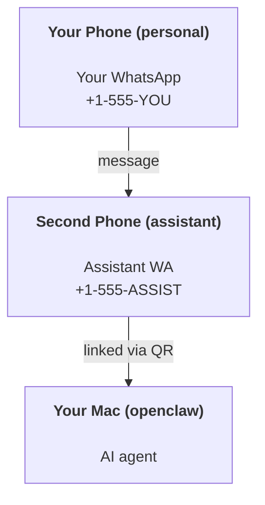
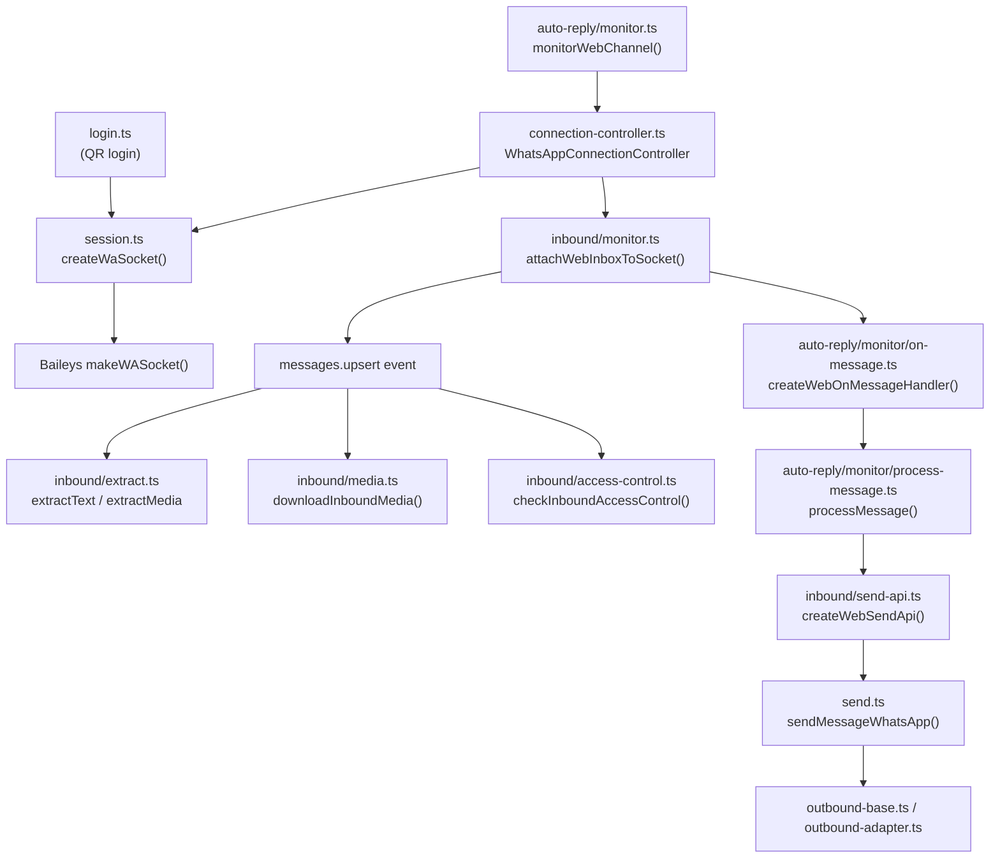

# DeepWiki Q&A with Code Context for Repository: openclaw/openclaw
## Q1
when connected to whatsapp over baileys does openclaw agent given a new number so that user can message the openclaw agent?
### Answer
The user is asking about how OpenClaw connects to WhatsApp via Baileys - specifically whether the OpenClaw agent gets a new number or if users message an existing number. Let me search the codebase to understand the WhatsApp/Baileys integration.

The user is asking whether OpenClaw assigns a new phone number to the agent when connecting via WhatsApp/Baileys, or if users message an existing number. Based on what I've already found, I can answer this clearly.

The key information is in `docs/channels/whatsapp.md` and `docs/start/openclaw.md`:

1. OpenClaw does NOT assign a new number. It uses WhatsApp Web (Baileys) to link to an **existing** WhatsApp account/number via QR code scanning.
2. The recommended setup is to use a **dedicated/separate** phone number (a second SIM/eSIM/prepaid) for the assistant, but this is not mandatory.
3. Users then message that linked number to interact with the OpenClaw agent.

The login flow shows a QR code that you scan with the WhatsApp app on a phone - meaning the number is whatever phone you scan the QR with.


No, OpenClaw does **not** provision or assign a new number. It uses **WhatsApp Web (Baileys)** to link to an existing WhatsApp account via QR code scanning — the number belongs to whatever phone scans the QR.

## How it works

The login command displays a QR code in the terminal:

```bash
openclaw channels login --channel whatsapp
```

You scan that QR with the WhatsApp app on a phone (under **Linked Devices**), exactly like linking WhatsApp Web in a browser. The gateway then acts as a linked device on that phone's number. openclaw:23-27 

Users then message **that phone's number** to reach the OpenClaw agent.

## Recommended: dedicated number

The docs strongly recommend using a **second phone/SIM** specifically for the assistant, rather than your personal number: openclaw:30-40 

The reasoning:
- If you link your personal WhatsApp, **every message you receive** becomes agent input.
- A dedicated number gives cleaner `allowFrom` allowlists and routing boundaries.
- It avoids self-chat confusion. openclaw:112-114 

## Personal number is also supported

If you don't have a second number, onboarding supports a personal-number fallback mode, which sets `dmPolicy: "allowlist"` and enables `selfChatMode: true` so you can message yourself to reach the agent. openclaw:141-150
### Citations
**File:** extensions/whatsapp/src/login.ts (L23-27)
```typescript
  const onQr = (qr: string) => {
    runtime.log("Open the WhatsApp app, go to Linked Devices, then scan this QR:");
    void renderQrTerminal(qr, { small: true })
      .then((output) => {
        runtime.log(output.endsWith("\n") ? output.slice(0, -1) : output);
```
**File:** docs/start/openclaw.md (L30-40)
```markdown
## The two-phone setup (recommended)

You want this:



If you link your personal WhatsApp to OpenClaw, every message to you becomes "agent input". That's rarely what you want.
```
**File:** docs/channels/whatsapp.md (L112-114)
```markdown
<Note>
OpenClaw recommends running WhatsApp on a separate number when possible. (The channel metadata and setup flow are optimized for that setup, but personal-number setups are also supported.)
</Note>
```
**File:** docs/channels/whatsapp.md (L141-150)
```markdown
  <Accordion title="Personal-number fallback">
    Onboarding supports personal-number mode and writes a self-chat-friendly baseline:

    - `dmPolicy: "allowlist"`
    - `allowFrom` includes your personal number
    - `selfChatMode: true`

    In runtime, self-chat protections key off the linked self number and `allowFrom`.

  </Accordion>
```
## Q2
how does whatsapp integration over baileys work. Give me complete code tour of all the responsible files making this possible from the estabilitshing connection to managing it and recieving update , new message events and able to able to reply to them including multi model data ..etc
### Answer
The user wants a comprehensive code tour of the WhatsApp/Baileys integration in openclaw. Let me explore the codebase thoroughly to understand all the files involved. I'll start by listing the directory structure and doing parallel searches.

Let me gather more information about the key files in parallel - I need to read the full content of the most important files to give a comprehensive code tour.

Let me gather more information about the key files in parallel - I need to read the inbound monitor, send.ts, outbound-base.ts, and the auto-reply monitor to give a comprehensive code tour.

Now I have a comprehensive understanding of the WhatsApp/Baileys integration. Let me also quickly read the auto-reply monitor.ts continuation and the inbound/send-api.ts to complete the picture.

Now I have a comprehensive understanding of the entire WhatsApp/Baileys integration. Let me synthesize this into a complete code tour.

The key files and their roles:

1. **`session.ts`** - Core socket factory (`createWaSocket`), wraps `makeWASocket` from Baileys, handles auth state, QR, creds persistence
2. **`login.ts`** - Interactive login flow, QR display, calls `createWaSocket` + `waitForWhatsAppLoginResult`
3. **`connection-controller.ts`** - `WhatsAppConnectionController` class - manages the lifecycle of a live connection, reconnect logic, heartbeat/watchdog timers
4. **`reconnect.ts`** - Backoff policy, `DEFAULT_RECONNECT_POLICY`, `computeBackoff`, `sleepWithAbort`
5. **`inbound/monitor.ts`** - `attachWebInboxToSocket` - the main inbox listener, handles `messages.upsert` events, normalizes messages, enriches with media, debounces, access control
6. **`inbound/extract.ts`** - Extracts text, media placeholders, location, contact, reply context from Baileys proto messages
7. **`inbound/media.ts`** - Downloads inbound media via `downloadMediaMessage`
8. **`inbound/access-control.ts`** - `checkInboundAccessControl` - allowlist/pairing/group policy enforcement
9. **`inbound/send-api.ts`** - `createWebSendApi` - builds the send surface (sendMessage, sendPoll, sendReaction, sendComposingTo)
10. **`auto-reply/monitor.ts`** - `monitorWebChannel` - top-level orchestrator, creates `WhatsAppConnectionController`, runs the reconnect loop
11. **`auto-reply/monitor/on-message.ts`** - `createWebOnMessageHandler` - routes messages to agents
12. **`auto-reply/monitor/process-message.ts`** - `processMessage` - builds context, dispatches to AI agent, delivers reply
13. **`send.ts`** - `sendMessageWhatsApp`, `sendPollWhatsApp`, `sendReactionWhatsApp` - outbound API
14. **`outbound-adapter.ts`** - `whatsappOutbound` - `ChannelOutboundAdapter` implementation
15. **`outbound-base.ts`** - `createWhatsAppOutboundBase` - shared outbound logic (text, media, poll)

Let me now write a comprehensive code tour.


Here is a complete code tour of the WhatsApp/Baileys integration, from socket creation to replying with media.

---

## Architecture overview



---

## 1. Socket creation — `session.ts`

`createWaSocket` is the single factory for every Baileys socket in the system. openclaw:130-137 

It:
1. Loads auth state from disk via Baileys' `useMultiFileAuthState(authDir)` openclaw:154-157 
2. Fetches the latest Baileys protocol version with `fetchLatestBaileysVersion()` openclaw:158-158 
3. Calls `makeWASocket({ auth, version, browser: ["openclaw","cli",VERSION], syncFullHistory: false, markOnlineOnConnect: false, ... })` openclaw:168-184 
4. Registers `creds.update` → enqueues an atomic write of `creds.json` to disk openclaw:186-186 
5. Registers `connection.update` → handles QR display, logged-out detection, verbose open log openclaw:187-218 
6. Attaches a WebSocket-level `error` handler to prevent unhandled exceptions openclaw:221-225 

`waitForWaConnection` wraps the socket in a promise that resolves on `connection === "open"` and rejects on `connection === "close"`. openclaw:305-326 

---

## 2. Interactive login — `login.ts`

`loginWeb` is the CLI entry point for `openclaw channels login`.

It creates a socket with `printQr: false` but passes an `onQr` callback that renders the QR in the terminal via `renderQrTerminal`. openclaw:23-37 

It then calls `waitForWhatsAppLoginResult` (in `connection-controller.ts`) which handles the special **code 515** restart-after-pairing case by closing the socket and creating a fresh one. openclaw:188-259 

---

## 3. Connection lifecycle — `connection-controller.ts`

`WhatsAppConnectionController` is the stateful manager for a running connection. It is constructed once per account in `monitorWebChannel` and lives for the entire process lifetime.

**Opening a connection:**
```
openConnection() → createWaSocket() → waitForWaConnection() → createListener() → startTimers()
``` openclaw:396-447 

**Timers started on every connection:**
- **Heartbeat** — fires every `heartbeatSeconds` (default 60s), logs stats openclaw:617-623 
- **Watchdog** — checks `lastTransportActivityAt` and `lastInboundAt`; if stale beyond thresholds, calls `forceClose({ status: 499 })` to trigger a reconnect openclaw:625-646 

**Transport activity** is tracked by listening to the raw WebSocket `frame` event: openclaw:649-665 

**Reconnect decision** (`resolveCloseDecision`) checks:
- `isLoggedOut` → stop, clear auth
- `isNonRetryableStatus` (440 = session conflict) → stop
- Otherwise → exponential backoff retry via `computeBackoff` openclaw:486-534 

---

## 4. Reconnect policy — `reconnect.ts`

Default policy: initial 2s, max 30s, factor 1.8, jitter 25%, max 12 attempts. openclaw:15-21 

---

## 5. Top-level orchestrator — `auto-reply/monitor.ts`

`monitorWebChannel` is the main entry point for the running gateway. It:

1. Resolves account config, reconnect policy, socket timing openclaw:157-186 
2. Creates a `WhatsAppConnectionController` openclaw:228-242 
3. Runs a `while(true)` reconnect loop — each iteration calls `controller.openConnection(...)` with a `createListener` factory that calls `attachWebInboxToSocket` openclaw:244-316 
4. The `onMessage` callback passed to `attachWebInboxToSocket` calls `controller.noteInbound()` then the `onMessage` handler created by `createWebOnMessageHandler` openclaw:309-314 

---

## 6. Inbox listener — `inbound/monitor.ts`

`attachWebInboxToSocket` is the core inbound engine. It attaches to the Baileys socket and returns a listener object.

**On connect:**
- Sends a global presence update (`available` or `unavailable` for self-chat mode) openclaw:201-211 
- Reads the self-identity (JID + E.164) from the auth dir openclaw:213-222 
- Hydrates group metadata cache via `sock.groupFetchAllParticipating()` openclaw:881-906 

**Event listeners registered:**
- `messages.upsert` → `handleMessagesUpsert` openclaw:862-870 
- `connection.update` → `handleConnectionUpdate` (resolves the `onClose` promise on disconnect) openclaw:842-861 

**`handleMessagesUpsert` pipeline:**

```
messages.upsert (type: "notify"|"append")
  → normalizeInboundMessage()   — filter status/broadcast JIDs, echo suppression, access control
  → maybeMarkInboundAsRead()    — send blue ticks
  → enrichInboundMessage()      — extract text, media, location, reply context
  → claimRecentInboundMessage() — deduplication
  → enqueueInboundMessage()     — build WebInboundMessage, push to debouncer
``` openclaw:805-841 

**Debouncer** batches rapid consecutive messages from the same sender into a single `combinedBody` before calling `options.onMessage`. openclaw:244-302 

**`normalizeInboundMessage`** filters:
- `@status` / `@broadcast` JIDs
- Echo suppression: own outbound messages tracked by `rememberRecentOutboundMessage` openclaw:499-516 
- Messages without user content (receipts, typing indicators) via `hasInboundUserContent` openclaw:525-527 
- Access control via `checkInboundAccessControl` (allowlist / pairing / group policy) openclaw:551-570 

**`enqueueInboundMessage`** builds the full `WebInboundMessage` object including `reply()` and `sendMedia()` closures that call `sendTrackedMessage` (which retries across reconnects). openclaw:677-803 

---

## 7. Message content extraction — `inbound/extract.ts`

Handles all Baileys proto message types:

| Function | What it extracts |
|---|---|
| `extractText` | `conversation`, `extendedTextMessage.text`, image/video/doc captions |
| `extractMediaPlaceholder` | `<media:image>`, `<media:video>`, `<media:audio>`, etc. |
| `extractLocationData` | `locationMessage`, `liveLocationMessage` with lat/lng |
| `extractContactContext` | `contactMessage` / `contactsArrayMessage` with vCard parsing |
| `describeReplyContext` | Quoted message body + sender from `contextInfo.quotedMessage` |
| `extractMentionedJids` | `contextInfo.mentionedJid` across all message types |
| `hasInboundUserContent` | Fast gate: returns false for receipts/protocol messages | openclaw:236-271 

Message unwrapping handles nested wrappers: `ephemeralMessage`, `viewOnceMessage`, `viewOnceMessageV2`, `documentWithCaptionMessage`, `groupMentionedMessage`, `botInvokeMessage`. openclaw:14-22 

---

## 8. Inbound media download — `inbound/media.ts`

`downloadInboundMedia` calls Baileys' `downloadMediaMessage` for image, video, audio, document, and sticker messages. It resolves MIME type with fallbacks (e.g. audio → `audio/ogg; codecs=opus`). openclaw:43-77 

`downloadQuotedInboundMedia` extracts the quoted message from `contextInfo` and downloads its media too. openclaw:79-102 

The buffer is saved to disk via `saveMediaBuffer` and the path is attached to the `WebInboundMessage` as `mediaPath`. openclaw:634-653 

---

## 9. Access control — `inbound/access-control.ts`

`checkInboundAccessControl` enforces:
- `dmPolicy`: `open` / `allowlist` / `pairing` for DMs
- `groupPolicy`: `open` / `allowlist` / `disabled` for groups
- Self-chat detection
- Pairing challenge issuance for unknown senders openclaw:29-80 

---

## 10. Message routing & processing — `auto-reply/monitor/on-message.ts` + `process-message.ts`

`createWebOnMessageHandler` returns an `onMessage(msg)` function. For each message it:
1. Resolves the agent route (`resolveAgentRoute`)
2. Calls `processMessage(...)` openclaw:37-80 

`processMessage` builds the full `ctxPayload` (inbound context for the AI), calls `runInboundReplyTurn`, which calls `dispatchWhatsAppBufferedReply` to get the AI reply and deliver it. openclaw:341-530 

---

## 11. Outbound send — `inbound/send-api.ts`

`createWebSendApi` builds the send surface attached to every active listener:

| Method | What it does |
|---|---|
| `sendMessage(to, text, mediaBuffer?, mediaType?)` | Sends text or image/video/audio/document based on MIME type |
| `sendPoll(to, poll)` | Sends a native WhatsApp poll |
| `sendReaction(chatJid, messageId, emoji)` | Sends an emoji reaction |
| `sendComposingTo(to)` | Sends `composing` presence (typing indicator) | openclaw:62-136 

Media type dispatch in `sendMessage`:
- `image/*` → `{ image: buffer, caption, mimetype }`
- `audio/*` → `{ audio: buffer, ptt: true, mimetype }` (voice note)
- `video/*` → `{ video: buffer, caption, gifPlayback? }`
- anything else → `{ document: buffer, fileName, caption, mimetype }` openclaw:81-109 

All sends go through `sendTrackedMessage` which records the outbound message ID in the echo-suppression registry and retries across reconnects. openclaw:325-370 

---

## 12. Proactive outbound — `send.ts` + `outbound-adapter.ts`

For agent-initiated sends (not replies), `sendMessageWhatsApp` in `send.ts`:
1. Looks up the active `WhatsAppConnectionController` from the registry
2. Gets the `ActiveWebListener` from it
3. Calls `active.sendMessage(to, text, mediaBuffer, mediaType)` openclaw:57-184 

`whatsappOutbound` in `outbound-adapter.ts` is the `ChannelOutboundAdapter` that the plugin SDK calls for all channel sends. It delegates to `sendMessageWhatsApp` and `sendPollWhatsApp`. openclaw:21-36 

`createWhatsAppOutboundBase` in `outbound-base.ts` handles text chunking (4000 char limit), quoted-message threading, and markdown→WhatsApp formatting. openclaw:143-155 

---

## File map summary

| File | Role |
|---|---|
| `session.ts` | `createWaSocket` — Baileys socket factory, auth, QR, creds persistence |
| `login.ts` | Interactive QR login CLI flow |
| `connection-controller.ts` | `WhatsAppConnectionController` — lifecycle, heartbeat, watchdog, reconnect |
| `reconnect.ts` | Backoff policy constants and helpers |
| `auto-reply/monitor.ts` | `monitorWebChannel` — top-level reconnect loop |
| `inbound/monitor.ts` | `attachWebInboxToSocket` — `messages.upsert` handler, debouncer, enrichment |
| `inbound/extract.ts` | Proto message content extraction (text, media, location, contact, reply) |
| `inbound/media.ts` | `downloadInboundMedia` / `downloadQuotedInboundMedia` |
| `inbound/access-control.ts` | `checkInboundAccessControl` — allowlist/pairing/group policy |
| `inbound/send-api.ts` | `createWebSendApi` — reply/poll/reaction/composing surface |
| `auto-reply/monitor/on-message.ts` | `createWebOnMessageHandler` — routes to agent |
| `auto-reply/monitor/process-message.ts` | `processMessage` — builds AI context, dispatches reply |
| `send.ts` | `sendMessageWhatsApp` / `sendPollWhatsApp` / `sendReactionWhatsApp` |
| `outbound-adapter.ts` | `whatsappOutbound` — `ChannelOutboundAdapter` |
| `outbound-base.ts` | `createWhatsAppOutboundBase` — chunking, quoting, markdown |
### Citations
**File:** extensions/whatsapp/src/session.ts (L130-137)
```typescript
export async function createWaSocket(
  printQr: boolean,
  verbose: boolean,
  opts: {
    authDir?: string;
    onQr?: (qr: string) => void;
  } & WhatsAppSocketTimingOptions = {},
): Promise<ReturnType<typeof makeWASocket>> {
```
**File:** extensions/whatsapp/src/session.ts (L154-157)
```typescript
  const { state } = await useMultiFileAuthState(authDir);
  const saveCreds = async () => {
    await writeCredsJsonAtomically(authDir, state.creds);
  };
```
**File:** extensions/whatsapp/src/session.ts (L158-158)
```typescript
  const { version } = await fetchLatestBaileysVersion();
```
**File:** extensions/whatsapp/src/session.ts (L168-184)
```typescript
  const sock = makeWASocket({
    auth: {
      creds: state.creds,
      keys: makeCacheableSignalKeyStore(state.keys, logger),
    },
    version,
    logger,
    printQRInTerminal: false,
    browser: ["openclaw", "cli", VERSION],
    syncFullHistory: false,
    markOnlineOnConnect: false,
    ...socketTiming,
    agent,
    // Baileys types still model `fetchAgent` as a Node agent even though the
    // runtime path accepts an undici dispatcher for upload fetches.
    fetchAgent: fetchAgent as Agent | undefined,
  });
```
**File:** extensions/whatsapp/src/session.ts (L186-186)
```typescript
  sock.ev.on("creds.update", () => enqueueSaveCreds(authDir, saveCreds, sessionLogger));
```
**File:** extensions/whatsapp/src/session.ts (L187-218)
```typescript
  sock.ev.on(
    "connection.update",
    async (update: Partial<import("@whiskeysockets/baileys").ConnectionState>) => {
      try {
        const { connection, lastDisconnect, qr } = update;
        if (qr) {
          opts.onQr?.(qr);
          if (printQr) {
            console.log("Open the WhatsApp app, go to Linked Devices, then scan this QR:");
            void printTerminalQr(qr).catch((err) => {
              sessionLogger.warn({ error: String(err) }, "failed rendering WhatsApp QR");
            });
          }
        }
        if (connection === "close") {
          const status = getStatusCode(lastDisconnect?.error);
          if (status === LOGGED_OUT_STATUS) {
            console.error(
              danger(
                `WhatsApp session logged out. Run: ${formatCliCommand("openclaw channels login")}`,
              ),
            );
          }
        }
        if (connection === "open" && verbose) {
          console.log(success("WhatsApp Web connected."));
        }
      } catch (err) {
        sessionLogger.error({ error: String(err) }, "connection.update handler error");
      }
    },
  );
```
**File:** extensions/whatsapp/src/session.ts (L221-225)
```typescript
  if (sock.ws && typeof (sock.ws as unknown as { on?: unknown }).on === "function") {
    sock.ws.on("error", (err: Error) => {
      sessionLogger.error({ error: String(err) }, "WebSocket error");
    });
  }
```
**File:** extensions/whatsapp/src/session.ts (L305-326)
```typescript
export async function waitForWaConnection(sock: ReturnType<typeof makeWASocket>) {
  return new Promise<void>((resolve, reject) => {
    type OffCapable = {
      off?: (event: string, listener: (...args: unknown[]) => void) => void;
    };
    const evWithOff = sock.ev as unknown as OffCapable;

    const handler = (...args: unknown[]) => {
      const update = (args[0] ?? {}) as Partial<import("@whiskeysockets/baileys").ConnectionState>;
      if (update.connection === "open") {
        evWithOff.off?.("connection.update", handler);
        resolve();
      }
      if (update.connection === "close") {
        evWithOff.off?.("connection.update", handler);
        reject(update.lastDisconnect ?? new Error("Connection closed"));
      }
    };

    sock.ev.on("connection.update", handler);
  });
}
```
**File:** extensions/whatsapp/src/login.ts (L23-37)
```typescript
  const onQr = (qr: string) => {
    runtime.log("Open the WhatsApp app, go to Linked Devices, then scan this QR:");
    void renderQrTerminal(qr, { small: true })
      .then((output) => {
        runtime.log(output.endsWith("\n") ? output.slice(0, -1) : output);
      })
      .catch((err) => {
        runtime.error(`failed rendering WhatsApp QR: ${String(err)}`);
      });
  };
  let sock = await createWaSocket(false, verbose, {
    authDir: account.authDir,
    ...socketTiming,
    onQr,
  });
```
**File:** extensions/whatsapp/src/connection-controller.ts (L188-259)
```typescript
export async function waitForWhatsAppLoginResult(params: {
  sock: WaSocket;
  authDir: string;
  isLegacyAuthDir: boolean;
  verbose: boolean;
  runtime: RuntimeEnv;
  waitForConnection?: typeof waitForWaConnection;
  createSocket?: typeof createWaSocket;
  socketTiming?: WhatsAppSocketTimingOptions;
  onQr?: (qr: string) => void;
  onSocketReplaced?: (sock: WaSocket) => void;
}): Promise<WhatsAppLoginWaitResult> {
  const wait = params.waitForConnection ?? waitForWaConnection;
  const createSocket = params.createSocket ?? createWaSocket;
  let currentSock = params.sock;
  let restarted = false;

  while (true) {
    try {
      await wait(currentSock);
      return {
        outcome: "connected",
        restarted,
        sock: currentSock,
      };
    } catch (err) {
      const statusCode = getStatusCode(err);
      if (statusCode === 515 && !restarted) {
        restarted = true;
        params.runtime.log(info(WHATSAPP_LOGIN_RESTART_MESSAGE));
        closeWaSocket(currentSock);
        try {
          currentSock = await createSocket(false, params.verbose, {
            authDir: params.authDir,
            ...params.socketTiming,
            onQr: params.onQr,
          });
          params.onSocketReplaced?.(currentSock);
          continue;
        } catch (createErr) {
          return {
            outcome: "failed",
            message: formatError(createErr),
            statusCode: getStatusCode(createErr),
            error: createErr,
          };
        }
      }

      if (statusCode === LOGGED_OUT_STATUS) {
        await logoutWeb({
          authDir: params.authDir,
          isLegacyAuthDir: params.isLegacyAuthDir,
          runtime: params.runtime,
        });
        return {
          outcome: "logged-out",
          message: WHATSAPP_LOGGED_OUT_RELINK_MESSAGE,
          statusCode: LOGGED_OUT_STATUS,
          error: err,
        };
      }

      return {
        outcome: "failed",
        message: formatError(err),
        statusCode,
        error: err,
      };
    }
  }
}
```
**File:** extensions/whatsapp/src/connection-controller.ts (L396-447)
```typescript
  async openConnection(params: {
    connectionId: string;
    createListener: (context: {
      sock: WASocket;
      connection: WhatsAppLiveConnection;
    }) => Promise<ManagedWhatsAppListener>;
    onHeartbeat?: (snapshot: WhatsAppConnectionSnapshot) => void;
    onWatchdogTimeout?: (snapshot: WhatsAppConnectionSnapshot) => void;
  }): Promise<WhatsAppLiveConnection> {
    if (this.current) {
      await this.closeCurrentConnection();
    }

    let sock: WaSocket | null = null;
    let connection: WhatsAppLiveConnection | null = null;
    try {
      sock = await createWaSocket(false, this.verbose, {
        authDir: this.authDir,
        ...this.socketTiming,
      });
      await waitForWaConnection(sock);

      this.socketRef.current = sock;
      const placeholderListener = {} as ManagedWhatsAppListener;
      connection = createLiveConnection({
        connectionId: params.connectionId,
        sock,
        listener: placeholderListener,
        openedAfterRecentInbound: this.isOpeningAfterRecentInbound(),
      });
      const listener = await params.createListener({ sock, connection });
      connection.listener = listener;
      this.current = connection;
      connection.unregisterTransportActivity = this.attachTransportActivityListener(sock);
      registerWhatsAppConnectionController(this.accountId, this);
      this.startTimers(connection, {
        onHeartbeat: params.onHeartbeat,
        onWatchdogTimeout: params.onWatchdogTimeout,
      });
      return connection;
    } catch (err) {
      if (this.socketRef.current === sock) {
        this.socketRef.current = null;
      }
      closeWaSocket(sock);
      if (connection?.unregisterUnhandled) {
        connection.unregisterUnhandled();
      }
      connection?.unregisterTransportActivity?.();
      throw err;
    }
  }
```
**File:** extensions/whatsapp/src/connection-controller.ts (L486-534)
```typescript
  resolveCloseDecision(
    reason: WebListenerCloseReason | "aborted",
  ): WhatsAppConnectionCloseDecision | "aborted" {
    if (reason === "aborted" || this.isStopRequested()) {
      return "aborted";
    }

    const current = this.current;
    if (current && Date.now() - current.startedAt > this.heartbeatSeconds * 1000) {
      this.reconnectAttempts = 0;
    }

    const normalized = this.normalizeCloseReason(reason);
    if (normalized.isLoggedOut) {
      return {
        action: "stop",
        reconnectAttempts: this.reconnectAttempts,
        healthState: "logged-out",
        normalized,
      };
    }

    if (this.isNonRetryableStatus(normalized.statusCode)) {
      return {
        action: "stop",
        reconnectAttempts: this.reconnectAttempts,
        healthState: "conflict",
        normalized,
      };
    }

    const retryDecision = this.consumeReconnectAttempt();
    if (retryDecision.action === "stop") {
      return {
        action: "stop",
        reconnectAttempts: retryDecision.reconnectAttempts,
        healthState: retryDecision.healthState,
        normalized,
      };
    }

    return {
      action: "retry",
      delayMs: retryDecision.delayMs,
      reconnectAttempts: retryDecision.reconnectAttempts,
      healthState: retryDecision.healthState,
      normalized,
    };
  }
```
**File:** extensions/whatsapp/src/connection-controller.ts (L617-623)
```typescript
    connection.heartbeat = setInterval(() => {
      const snapshot = this.getCurrentSnapshot(connection);
      if (!snapshot) {
        return;
      }
      hooks.onHeartbeat?.(snapshot);
    }, this.heartbeatSeconds * 1000);
```
**File:** extensions/whatsapp/src/connection-controller.ts (L625-646)
```typescript
    connection.watchdogTimer = setInterval(() => {
      const now = Date.now();
      const transportStaleForMs = now - connection.lastTransportActivityAt;
      const appBaselineAt = connection.lastInboundAt ?? connection.startedAt;
      const appSilentForMs = now - appBaselineAt;
      const appSilenceTimeoutMs = connection.openedAfterRecentInbound
        ? this.messageTimeoutMs
        : this.appSilenceTimeoutMs;
      if (transportStaleForMs <= this.transportTimeoutMs && appSilentForMs <= appSilenceTimeoutMs) {
        return;
      }
      const snapshot = this.getCurrentSnapshot(connection);
      if (!snapshot) {
        return;
      }
      hooks.onWatchdogTimeout?.(snapshot);
      this.forceClose({
        status: 499,
        isLoggedOut: false,
        error: "watchdog-timeout",
      });
    }, this.watchdogCheckMs);
```
**File:** extensions/whatsapp/src/connection-controller.ts (L649-665)
```typescript
  private attachTransportActivityListener(sock: WASocket): (() => void) | null {
    const ws = sock.ws as SocketActivityEmitter | undefined;
    if (!ws || typeof ws.on !== "function") {
      return null;
    }

    const noteActivity = () => this.noteTransportActivity();
    ws.on("frame", noteActivity);

    return () => {
      if (typeof ws.off === "function") {
        ws.off("frame", noteActivity);
        return;
      }
      ws.removeListener?.("frame", noteActivity);
    };
  }
```
**File:** extensions/whatsapp/src/reconnect.ts (L15-21)
```typescript
export const DEFAULT_RECONNECT_POLICY: ReconnectPolicy = {
  initialMs: 2_000,
  maxMs: 30_000,
  factor: 1.8,
  jitter: 0.25,
  maxAttempts: 12,
};
```
**File:** extensions/whatsapp/src/auto-reply/monitor.ts (L157-186)
```typescript
  const baseCfg = getRuntimeConfig();
  const sourceCfg = getRuntimeConfigSourceSnapshot();
  const account = resolveWhatsAppAccount({
    cfg: baseCfg,
    accountId: tuning.accountId,
  });
  const cfg = {
    ...baseCfg,
    channels: {
      ...baseCfg.channels,
      whatsapp: {
        ...baseCfg.channels?.whatsapp,
        ackReaction: account.ackReaction,
        messagePrefix: account.messagePrefix,
        allowFrom: account.allowFrom,
        groupAllowFrom: account.groupAllowFrom,
        groupPolicy: account.groupPolicy,
        textChunkLimit: account.textChunkLimit,
        chunkMode: account.chunkMode,
        mediaMaxMb: account.mediaMaxMb,
        blockStreaming: account.blockStreaming,
        groups: account.groups,
      },
    },
  } satisfies ReturnType<typeof getRuntimeConfig>;

  const maxMediaBytes = resolveWhatsAppMediaMaxBytes(account);
  const heartbeatSeconds = resolveHeartbeatSeconds(cfg, tuning.heartbeatSeconds);
  const reconnectPolicy = resolveReconnectPolicy(cfg, tuning.reconnect);
  const socketTiming = resolveWhatsAppSocketTiming(cfg, tuning.socketTiming);
```
**File:** extensions/whatsapp/src/auto-reply/monitor.ts (L228-242)
```typescript
  const controller = new WhatsAppConnectionController({
    accountId: account.accountId,
    authDir: account.authDir,
    verbose,
    keepAlive,
    heartbeatSeconds,
    transportTimeoutMs,
    messageTimeoutMs,
    watchdogCheckMs,
    reconnectPolicy,
    socketTiming,
    abortSignal,
    sleep,
    isNonRetryableStatus: isNonRetryableWebCloseStatus,
  });
```
**File:** extensions/whatsapp/src/auto-reply/monitor.ts (L244-316)
```typescript
  try {
    while (true) {
      if (stopRequested()) {
        break;
      }

      const connectionId = newConnectionId();
      const inboundDebounceMs = resolveInboundDebounceMs({
        cfg,
        channel: "whatsapp",
        overrideMs: resolveExplicitWhatsAppDebounceOverride({
          cfg,
          sourceCfg,
          accountId: account.accountId,
        }),
      });
      const shouldDebounce = (msg: WebInboundMsg) => {
        if (msg.mediaPath || msg.mediaType) {
          return false;
        }
        if (msg.location) {
          return false;
        }
        if (msg.replyToId || msg.replyToBody) {
          return false;
        }
        return !hasControlCommand(msg.body, cfg);
      };

      let connection;
      try {
        connection = await controller.openConnection({
          connectionId,
          createListener: async ({ sock, connection }) => {
            const onMessage = createWebOnMessageHandler({
              cfg,
              verbose,
              connectionId,
              maxMediaBytes,
              groupHistoryLimit,
              groupHistories,
              groupMemberNames,
              echoTracker,
              backgroundTasks: connection.backgroundTasks,
              replyResolver: activeReplyResolver,
              replyLogger,
              baseMentionConfig,
              account,
            });

            return (await (listenerFactory ?? attachWebInboxToSocket)({
              cfg,
              verbose,
              accountId: account.accountId,
              authDir: account.authDir,
              mediaMaxMb: account.mediaMaxMb,
              selfChatMode: account.selfChatMode,
              sendReadReceipts: account.sendReadReceipts,
              debounceMs: inboundDebounceMs,
              shouldDebounce,
              socketRef: controller.socketRef,
              shouldRetryDisconnect: () => !sigintStop && controller.shouldRetryDisconnect(),
              disconnectRetryPolicy: reconnectPolicy,
              disconnectRetryAbortSignal: controller.getDisconnectRetryAbortSignal(),
              groupMetadataCache,
              onMessage: async (msg: WebInboundMsg) => {
                const inboundAt = Date.now();
                controller.noteInbound(inboundAt);
                statusController.noteInbound(inboundAt);
                await onMessage(msg);
              },
              sock,
            })) as ManagedWhatsAppListener;
```
**File:** extensions/whatsapp/src/inbound/monitor.ts (L201-211)
```typescript
  const presence = options.selfChatMode ? "unavailable" : "available";

  try {
    await sock.sendPresenceUpdate(presence);
    logWhatsAppVerbose(options.verbose, `Sent global '${presence}' presence on connect`);
  } catch (err) {
    logWhatsAppVerbose(
      options.verbose,
      `Failed to send '${presence}' presence on connect: ${String(err)}`,
    );
  }
```
**File:** extensions/whatsapp/src/inbound/monitor.ts (L213-222)
```typescript
  const selfIdentity = await readWebSelfIdentityForDecision(
    options.authDir,
    sock.user as { id?: string | null; lid?: string | null } | undefined,
  );
  if (selfIdentity.outcome === "unstable") {
    throw new WhatsAppAuthUnstableError(
      "WhatsApp auth state is still stabilizing; retrying inbox attach.",
    );
  }
  const self = selfIdentity.identity;
```
**File:** extensions/whatsapp/src/inbound/monitor.ts (L244-302)
```typescript
  const debouncer = createInboundDebouncer<QueuedInboundMessage>({
    debounceMs: options.debounceMs ?? 0,
    buildKey: (msg) => {
      const sender = msg.sender;
      const senderKey =
        msg.chatType === "group"
          ? (getPrimaryIdentityId(sender ?? null) ??
            msg.senderJid ??
            msg.senderE164 ??
            msg.senderName ??
            msg.from)
          : msg.from;
      if (!senderKey) {
        return null;
      }
      const conversationKey = msg.chatType === "group" ? msg.chatId : msg.from;
      return `${msg.accountId}:${conversationKey}:${senderKey}`;
    },
    shouldDebounce: options.shouldDebounce,
    onFlush: async (entries) => {
      const last = entries.at(-1);
      if (!last) {
        return;
      }
      try {
        if (entries.length === 1) {
          await options.onMessage(last);
          await finalizeInboundDedupe(entries);
          return;
        }
        const mentioned = new Set<string>();
        for (const entry of entries) {
          for (const jid of entry.mentions ?? entry.mentionedJids ?? []) {
            mentioned.add(jid);
          }
        }
        const combinedBody = entries
          .map((entry) => entry.body)
          .filter(Boolean)
          .join("\n");
        const combinedMessage: WebInboundMessage = {
          ...last,
          body: combinedBody,
          mentions: mentioned.size > 0 ? Array.from(mentioned) : undefined,
          mentionedJids: mentioned.size > 0 ? Array.from(mentioned) : undefined,
          isBatched: true,
        };
        await options.onMessage(combinedMessage);
        await finalizeInboundDedupe(entries);
      } catch (error) {
        await finalizeInboundDedupe(entries, error);
        throw error;
      }
    },
    onError: (err) => {
      inboundLogger.error({ error: String(err) }, "failed handling inbound web message");
      inboundConsoleLog.error(`Failed handling inbound web message: ${String(err)}`);
    },
  });
```
**File:** extensions/whatsapp/src/inbound/monitor.ts (L325-370)
```typescript
  const sendTrackedMessage = async (
    jid: string,
    content: AnyMessageContent,
    sendOptions?: MiscMessageGenerationOptions,
  ) => {
    let lastErr: unknown = new Error(RECONNECT_IN_PROGRESS_ERROR);
    for (let attempt = 1; ; attempt++) {
      const currentSock = getCurrentSock();
      if (currentSock) {
        try {
          const result = sendOptions
            ? await currentSock.sendMessage(jid, content, sendOptions)
            : await currentSock.sendMessage(jid, content);
          rememberOutboundMessage(jid, result);
          return result;
        } catch (err) {
          if (!shouldRetryDisconnect() || !isRetryableSendDisconnectError(err)) {
            throw err;
          }
          lastErr = err;
          if (
            shouldClearSocketRefAfterSendFailure(err) &&
            options.socketRef?.current === currentSock
          ) {
            options.socketRef.current = null;
          }
        }
      } else if (!shouldRetryDisconnect()) {
        throw lastErr;
      }

      if (attempt >= sendRetryMaxAttempts) {
        throw lastErr;
      }
      const delayMs = computeBackoff(disconnectRetryPolicy, attempt);
      logWhatsAppVerbose(
        options.verbose,
        `Waiting ${delayMs}ms for WhatsApp reconnect before retrying send to ${jid}: ${formatError(lastErr)}`,
      );
      try {
        await sleepWithAbort(delayMs, options.disconnectRetryAbortSignal);
      } catch {
        throw lastErr;
      }
    }
  };
```
**File:** extensions/whatsapp/src/inbound/monitor.ts (L499-516)
```typescript
    // Drop echoes of messages the gateway itself sent (tracked by sendTrackedMessage).
    // Applies to both groups and DMs/self-chat — without this, self-chat mode
    // re-processes the bot's own replies as new inbound user messages.
    if (
      Boolean(msg.key?.fromMe) &&
      id &&
      isRecentOutboundMessage({
        accountId: options.accountId,
        remoteJid,
        messageId: id,
      })
    ) {
      logWhatsAppVerbose(
        options.verbose,
        `Skipping recent outbound WhatsApp echo ${id} for ${remoteJid}`,
      );
      return null;
    }
```
**File:** extensions/whatsapp/src/inbound/monitor.ts (L525-527)
```typescript
    if (!hasInboundUserContent(msg.message ?? undefined)) {
      return null;
    }
```
**File:** extensions/whatsapp/src/inbound/monitor.ts (L551-570)
```typescript
    const access = await checkInboundAccessControl({
      cfg: options.cfg,
      accountId: options.accountId,
      from,
      selfE164: self.e164 ?? null,
      senderE164,
      group,
      pushName: msg.pushName ?? undefined,
      isFromMe: Boolean(msg.key?.fromMe),
      messageTimestampMs,
      connectedAtMs,
      verbose: options.verbose,
      sock: {
        sendMessage: (jid: string, content: AnyMessageContent) => sendTrackedMessage(jid, content),
      },
      remoteJid,
    });
    if (!access.allowed) {
      return null;
    }
```
**File:** extensions/whatsapp/src/inbound/monitor.ts (L634-653)
```typescript
    const saveInboundMedia = async (
      inboundMedia: Awaited<ReturnType<typeof downloadInboundMedia>>,
    ) => {
      if (!inboundMedia) {
        return;
      }
      const maxMb =
        typeof options.mediaMaxMb === "number" && options.mediaMaxMb > 0 ? options.mediaMaxMb : 50;
      const maxBytes = maxMb * 1024 * 1024;
      const saved = await saveMediaBuffer(
        inboundMedia.buffer,
        inboundMedia.mimetype,
        "inbound",
        maxBytes,
        inboundMedia.fileName,
      );
      mediaPath = saved.path;
      mediaType = inboundMedia.mimetype;
      mediaFileName = inboundMedia.fileName;
    };
```
**File:** extensions/whatsapp/src/inbound/monitor.ts (L677-803)
```typescript
  const enqueueInboundMessage = async (
    msg: WAMessage,
    inbound: NormalizedInboundMessage,
    enriched: EnrichedInboundMessage,
  ) => {
    const chatJid = inbound.remoteJid;
    const sendComposing = async () => {
      const currentSock = getCurrentSock();
      if (!currentSock) {
        return;
      }
      try {
        await currentSock.sendPresenceUpdate("composing", chatJid);
      } catch (err) {
        logWhatsAppVerbose(options.verbose, `Presence update failed: ${String(err)}`);
      }
    };
    const reply = async (text: string, options?: MiscMessageGenerationOptions) => {
      const resolved = await resolveOutboundMentionsForGroup(chatJid, text);
      const result = await sendTrackedMessage(
        chatJid,
        addWhatsAppOutboundMentionsToContent({ text: resolved.text }, resolved.mentionedJids),
        options,
      );
      return normalizeWhatsAppSendResult(result, "text");
    };
    const sendMedia = async (
      payload: AnyMessageContent,
      options?: MiscMessageGenerationOptions,
    ) => {
      const result = await sendTrackedMessage(
        chatJid,
        await applyOutboundMentionsToContent(chatJid, payload),
        options,
      );
      return normalizeWhatsAppSendResult(result, "media");
    };
    const timestamp = inbound.messageTimestampMs;
    const mentionedJids = extractMentionedJids(msg.message as proto.IMessage | undefined);
    const senderName = msg.pushName ?? undefined;

    inboundLogger.info(
      {
        from: inbound.from,
        to: self.e164 ?? "me",
        body: enriched.body,
        mediaPath: enriched.mediaPath,
        mediaType: enriched.mediaType,
        mediaFileName: enriched.mediaFileName,
        timestamp,
      },
      "inbound message",
    );
    const inboundMessage: QueuedInboundMessage = {
      id: inbound.id,
      from: inbound.from,
      conversationId: inbound.from,
      to: self.e164 ?? "me",
      accountId: inbound.access.resolvedAccountId,
      accessControlPassed: true,
      body: enriched.body,
      pushName: senderName,
      timestamp,
      chatType: inbound.group ? "group" : "direct",
      chatId: inbound.remoteJid,
      sender: resolveComparableIdentity({
        jid: inbound.participantJid,
        e164: inbound.senderE164 ?? undefined,
        name: senderName,
      }),
      senderJid: inbound.participantJid,
      senderE164: inbound.senderE164 ?? undefined,
      senderName,
      replyTo: enriched.replyContext ?? undefined,
      replyToId: enriched.replyContext?.id,
      replyToBody: enriched.replyContext?.body,
      replyToSender: enriched.replyContext?.sender?.label ?? undefined,
      replyToSenderJid: enriched.replyContext?.sender?.jid ?? undefined,
      replyToSenderE164: enriched.replyContext?.sender?.e164 ?? undefined,
      groupSubject: inbound.groupSubject,
      groupParticipants: inbound.groupParticipants,
      mentions: mentionedJids ?? undefined,
      mentionedJids: mentionedJids ?? undefined,
      self,
      selfJid: self.jid ?? undefined,
      selfLid: self.lid ?? undefined,
      selfE164: self.e164 ?? undefined,
      fromMe: Boolean(msg.key?.fromMe),
      location: enriched.location ?? undefined,
      untrustedStructuredContext: enriched.contactContext
        ? [
            {
              label: "WhatsApp contact",
              source: "whatsapp",
              type: enriched.contactContext.kind,
              payload: enriched.contactContext,
            },
          ]
        : undefined,
      sendComposing,
      reply,
      sendMedia,
      mediaPath: enriched.mediaPath,
      mediaType: enriched.mediaType,
      mediaFileName: enriched.mediaFileName,
      dedupeKey: inbound.id ? `${options.accountId}:${inbound.remoteJid}:${inbound.id}` : undefined,
    };
    if (inboundMessage.id) {
      cacheInboundMessageMeta(inboundMessage.accountId, inboundMessage.chatId, inboundMessage.id, {
        participant: inboundMessage.senderJid,
        participantE164:
          inboundMessage.chatType === "direct" ? inboundMessage.senderE164 : undefined,
        body: inboundMessage.body,
        fromMe: inboundMessage.fromMe,
      });
    }
    try {
      const task = Promise.resolve(debouncer.enqueue(inboundMessage));
      void task.catch((err) => {
        inboundLogger.error({ error: String(err) }, "failed handling inbound web message");
        inboundConsoleLog.error(`Failed handling inbound web message: ${String(err)}`);
      });
    } catch (err) {
      inboundLogger.error({ error: String(err) }, "failed handling inbound web message");
      inboundConsoleLog.error(`Failed handling inbound web message: ${String(err)}`);
    }
  };
```
**File:** extensions/whatsapp/src/inbound/monitor.ts (L805-841)
```typescript
  const handleMessagesUpsert = async (upsert: { type?: string; messages?: Array<WAMessage> }) => {
    if (upsert.type !== "notify" && upsert.type !== "append") {
      return;
    }
    for (const msg of upsert.messages ?? []) {
      const inbound = await normalizeInboundMessage(msg);
      if (!inbound) {
        continue;
      }

      await maybeMarkInboundAsRead(inbound);

      // If this is history/offline catch-up, mark read above but skip auto-reply.
      if (upsert.type === "append") {
        const APPEND_RECENT_GRACE_MS = 60_000;
        const msgTsRaw = msg.messageTimestamp;
        const msgTsNum = msgTsRaw != null ? Number(msgTsRaw) : Number.NaN;
        const msgTsMs = Number.isFinite(msgTsNum) ? msgTsNum * 1000 : 0;
        if (msgTsMs < connectedAtMs - APPEND_RECENT_GRACE_MS) {
          continue;
        }
      }

      const enriched = await enrichInboundMessage(msg);
      if (!enriched) {
        continue;
      }

      const dedupeKey = inbound.id ? `${options.accountId}:${inbound.remoteJid}:${inbound.id}` : "";
      if (dedupeKey && !(await claimRecentInboundMessage(dedupeKey))) {
        continue;
      }

      recordAcceptedInboundActivity(options.accountId);
      await enqueueInboundMessage(msg, inbound, enriched);
    }
  };
```
**File:** extensions/whatsapp/src/inbound/monitor.ts (L842-861)
```typescript
  const handleConnectionUpdate = (
    update: Partial<import("@whiskeysockets/baileys").ConnectionState>,
  ) => {
    try {
      if (update.connection === "close") {
        if (options.socketRef?.current === sock) {
          options.socketRef.current = null;
        }
        const status = getStatusCode(update.lastDisconnect?.error);
        resolveClose({
          status,
          isLoggedOut: status === LOGGED_OUT_STATUS,
          error: update.lastDisconnect?.error,
        });
      }
    } catch (err) {
      inboundLogger.error({ error: String(err) }, "connection.update handler error");
      resolveClose({ status: undefined, isLoggedOut: false, error: err });
    }
  };
```
**File:** extensions/whatsapp/src/inbound/monitor.ts (L862-870)
```typescript
  const detachMessagesUpsert = attachEmitterListener(
    sock.ev as unknown as {
      on: (event: string, listener: (...args: unknown[]) => void) => void;
      off?: (event: string, listener: (...args: unknown[]) => void) => void;
      removeListener?: (event: string, listener: (...args: unknown[]) => void) => void;
    },
    "messages.upsert",
    handleMessagesUpsert as unknown as (...args: unknown[]) => void,
  );
```
**File:** extensions/whatsapp/src/inbound/monitor.ts (L881-906)
```typescript
  void (async () => {
    try {
      const groups = await sock.groupFetchAllParticipating();
      for (const [jid, meta] of Object.entries(groups ?? {})) {
        if (meta) {
          rememberGroupMetadataCacheEntry(
            groupMetadataCache,
            jid,
            summarizeGroupMetaForReconnectCache(meta),
          );
        }
      }
      logWhatsAppVerbose(
        options.verbose,
        `Hydrated ${Object.keys(groups ?? {}).length} participating groups on connect`,
      );
    } catch (err) {
      const error = String(err);
      inboundLogger.warn({ error }, "failed hydrating participating groups on connect");
      inboundConsoleLog.warn(`Failed hydrating participating groups on connect: ${error}`);
      logWhatsAppVerbose(
        options.verbose,
        `Failed to hydrate participating groups on connect: ${error}`,
      );
    }
  })();
```
**File:** extensions/whatsapp/src/inbound/extract.ts (L14-22)
```typescript
const MESSAGE_WRAPPER_KEYS = [
  "botInvokeMessage",
  "ephemeralMessage",
  "viewOnceMessage",
  "viewOnceMessageV2",
  "viewOnceMessageV2Extension",
  "documentWithCaptionMessage",
  "groupMentionedMessage",
] as const;
```
**File:** extensions/whatsapp/src/inbound/extract.ts (L236-271)
```typescript
export function extractText(rawMessage: proto.IMessage | undefined): string | undefined {
  const message = unwrapMessage(rawMessage);
  if (!message) {
    return undefined;
  }
  const extracted = extractMessage(message);
  const candidates = [message, extracted && extracted !== message ? extracted : undefined];
  for (const candidate of candidates) {
    if (!candidate) {
      continue;
    }
    if (typeof candidate.conversation === "string" && candidate.conversation.trim()) {
      return candidate.conversation.trim();
    }
    const extended = candidate.extendedTextMessage?.text;
    if (extended?.trim()) {
      return extended.trim();
    }
    const caption =
      candidate.imageMessage?.caption ??
      candidate.videoMessage?.caption ??
      candidate.documentMessage?.caption;
    if (caption?.trim()) {
      return caption.trim();
    }
  }
  const contactPlaceholder =
    extractContactPlaceholder(message) ??
    (extracted && extracted !== message
      ? extractContactPlaceholder(extracted as proto.IMessage | undefined)
      : undefined);
  if (contactPlaceholder) {
    return contactPlaceholder;
  }
  return undefined;
}
```
**File:** extensions/whatsapp/src/inbound/media.ts (L43-77)
```typescript
export async function downloadInboundMedia(
  msg: proto.IWebMessageInfo,
  sock: Awaited<ReturnType<typeof createWaSocket>>,
): Promise<{ buffer: Buffer; mimetype?: string; fileName?: string } | undefined> {
  const message = unwrapMessage(msg.message as proto.IMessage | undefined);
  if (!message) {
    return undefined;
  }
  const mimetype = resolveMediaMimetype(message);
  const fileName = message.documentMessage?.fileName ?? undefined;
  if (
    !message.imageMessage &&
    !message.videoMessage &&
    !message.documentMessage &&
    !message.audioMessage &&
    !message.stickerMessage
  ) {
    return undefined;
  }
  try {
    const buffer = await downloadMediaMessage(
      msg as WAMessage,
      "buffer",
      {},
      {
        reuploadRequest: sock.updateMediaMessage,
        logger: sock.logger,
      },
    );
    return { buffer, mimetype, fileName };
  } catch (err) {
    logVerbose(`downloadMediaMessage failed: ${String(err)}`);
    return undefined;
  }
}
```
**File:** extensions/whatsapp/src/inbound/media.ts (L79-102)
```typescript
export async function downloadQuotedInboundMedia(
  msg: proto.IWebMessageInfo,
  sock: Awaited<ReturnType<typeof createWaSocket>>,
): Promise<{ buffer: Buffer; mimetype?: string; fileName?: string } | undefined> {
  const message = unwrapMessage(msg.message as proto.IMessage | undefined);
  const contextInfo = extractContextInfo(message);
  if (!contextInfo?.quotedMessage) {
    return undefined;
  }
  const quotedMessage = contextInfo.quotedMessage;
  return downloadInboundMedia(
    {
      key: {
        id: contextInfo?.stanzaId || undefined,
        remoteJid: contextInfo.remoteJid ?? msg.key?.remoteJid ?? undefined,
        participant: contextInfo?.participant ?? undefined,
        fromMe: false,
      },
      message: quotedMessage,
      messageTimestamp: msg.messageTimestamp,
    },
    sock,
  );
}
```
**File:** extensions/whatsapp/src/inbound/access-control.ts (L29-80)
```typescript
export async function checkInboundAccessControl(params: {
  cfg: OpenClawConfig;
  accountId: string;
  from: string;
  selfE164: string | null;
  senderE164: string | null;
  group: boolean;
  pushName?: string;
  isFromMe: boolean;
  messageTimestampMs?: number;
  connectedAtMs?: number;
  pairingGraceMs?: number;
  verbose?: boolean;
  sock: {
    sendMessage: (jid: string, content: { text: string }) => Promise<unknown>;
  };
  remoteJid: string;
}): Promise<InboundAccessControlResult> {
  const policy = resolveWhatsAppInboundPolicy({
    cfg: params.cfg,
    accountId: params.accountId,
    selfE164: params.selfE164,
  });
  const storeAllowFrom = params.group
    ? []
    : await readStoreAllowFromForDmPolicy({
        provider: "whatsapp",
        accountId: policy.account.accountId,
        dmPolicy: policy.dmPolicy,
        shouldRead: policy.shouldReadStorePairingApprovals,
      });
  const pairingGraceMs =
    typeof params.pairingGraceMs === "number" && params.pairingGraceMs > 0
      ? params.pairingGraceMs
      : PAIRING_REPLY_HISTORY_GRACE_MS;
  const suppressPairingReply =
    typeof params.connectedAtMs === "number" &&
    typeof params.messageTimestampMs === "number" &&
    params.messageTimestampMs < params.connectedAtMs - pairingGraceMs;

  // Group policy filtering:
  // - "open": groups bypass allowFrom, only mention-gating applies
  // - "disabled": block all group messages entirely
  // - "allowlist": only allow group messages from senders in groupAllowFrom/allowFrom
  warnMissingProviderGroupPolicyFallbackOnce({
    providerMissingFallbackApplied: policy.providerMissingFallbackApplied,
    providerKey: "whatsapp",
    accountId: policy.account.accountId,
    log: (message) => logWhatsAppVerbose(params.verbose, message),
  });
  const accessGroupSenderId = params.group ? (params.senderE164 ?? params.from) : params.from;
  const isAccessGroupSenderAllowed = (senderId: string, allowEntries: string[]) => {
```
**File:** extensions/whatsapp/src/auto-reply/monitor/on-message.ts (L37-80)
```typescript
  const processForRoute = async (
    msg: WebInboundMsg,
    route: ReturnType<typeof resolveAgentRoute>,
    groupHistoryKey: string,
    opts?: {
      groupHistory?: GroupHistoryEntry[];
      suppressGroupHistoryClear?: boolean;
      preflightAudioTranscript?: string | null;
      ackAlreadySent?: boolean;
      ackReaction?: AckReactionHandle | null;
    },
  ) => {
    const processParams: Parameters<typeof processMessage>[0] = {
      cfg: params.cfg,
      msg,
      route,
      groupHistoryKey,
      groupHistories: params.groupHistories,
      groupMemberNames: params.groupMemberNames,
      connectionId: params.connectionId,
      verbose: params.verbose,
      maxMediaBytes: params.maxMediaBytes,
      replyResolver: params.replyResolver,
      replyLogger: params.replyLogger,
      backgroundTasks: params.backgroundTasks,
      rememberSentText: params.echoTracker.rememberText,
      echoHas: params.echoTracker.has,
      echoForget: params.echoTracker.forget,
      buildCombinedEchoKey: params.echoTracker.buildCombinedKey,
    };
    if (opts?.groupHistory !== undefined) {
      processParams.groupHistory = opts.groupHistory;
    }
    if (opts?.suppressGroupHistoryClear !== undefined) {
      processParams.suppressGroupHistoryClear = opts.suppressGroupHistoryClear;
    }
    if (opts?.preflightAudioTranscript !== undefined) {
      processParams.preflightAudioTranscript = opts.preflightAudioTranscript;
    }
    if (opts?.ackAlreadySent === true) {
      processParams.ackAlreadySent = true;
    }
    if (opts?.ackReaction !== undefined) {
      processParams.ackReaction = opts.ackReaction;
```
**File:** extensions/whatsapp/src/auto-reply/monitor/process-message.ts (L341-530)
```typescript
  params.replyLogger.info(
    {
      connectionId: params.connectionId,
      correlationId,
      from: params.msg.chatType === "group" ? conversationId : params.msg.from,
      to: params.msg.to,
      body: elide(combinedBody, 240),
      mediaType: params.msg.mediaType ?? null,
      mediaPath: params.msg.mediaPath ?? null,
    },
    "inbound web message",
  );

  const fromDisplay = params.msg.chatType === "group" ? conversationId : params.msg.from;
  const kindLabel = params.msg.mediaType ? `, ${params.msg.mediaType}` : "";
  whatsappInboundLog.info(
    `Inbound message ${fromDisplay} -> ${params.msg.to} (${params.msg.chatType}${kindLabel}, ${combinedBody.length} chars)`,
  );
  if (shouldLogVerbose()) {
    whatsappInboundLog.debug(`Inbound body: ${elide(combinedBody, 400)}`);
  }

  const sender = getSenderIdentity(params.msg);
  const visibleReplyTo = resolveVisibleWhatsAppReplyContext({
    msg: params.msg,
    authDir: account.authDir,
    mode: contextVisibilityMode,
    groupPolicy: inboundPolicy.groupPolicy,
    groupAllowFrom: inboundPolicy.groupAllowFrom,
  });
  const dmRouteTarget = resolveWhatsAppDmRouteTarget({
    msg: params.msg,
    senderE164: sender.e164 ?? undefined,
    normalizeE164,
  });
  const commandAuthorized = shouldComputeCommandAuthorized(params.msg.body, params.cfg)
    ? await resolveWhatsAppCommandAuthorized({
        cfg: params.cfg,
        msg: params.msg,
        policy: inboundPolicy,
      })
    : undefined;
  const { onModelSelected, ...replyPipeline } = createChannelMessageReplyPipeline({
    cfg: params.cfg,
    agentId: params.route.agentId,
    channel: "whatsapp",
    accountId: params.route.accountId,
  });
  const responsePrefix = resolveWhatsAppResponsePrefix({
    cfg: params.cfg,
    agentId: params.route.agentId,
    isSelfChat: params.msg.chatType !== "group" && inboundPolicy.isSelfChat,
    pipelineResponsePrefix: replyPipeline.responsePrefix,
  });
  const replyThreading = resolveBatchedReplyThreadingPolicy(
    account.replyToMode ?? "off",
    params.msg.isBatched === true,
  );

  // Resolve combined conversation system prompt using the group or direct surface.
  const conversationSystemPrompt =
    params.msg.chatType === "group"
      ? resolveWhatsAppGroupSystemPrompt({
          accountConfig: account,
          groupId: conversationId,
        })
      : resolveWhatsAppDirectSystemPrompt({
          accountConfig: account,
          peerId: dmRouteTarget ?? params.msg.from,
        });

  const ctxPayload = buildWhatsAppInboundContext({
    bodyForAgent: msgForAgent.body,
    combinedBody,
    commandBody: params.msg.body,
    commandAuthorized,
    conversationId,
    groupHistory: visibleGroupHistory,
    groupMemberRoster: params.groupMemberNames.get(params.groupHistoryKey),
    groupSystemPrompt: conversationSystemPrompt,
    msg: params.msg,
    rawBody: params.msg.body,
    route: params.route,
    sender: {
      id: getPrimaryIdentityId(sender) ?? undefined,
      name: sender.name ?? undefined,
      e164: sender.e164 ?? undefined,
    },
    ...(audioTranscript !== undefined ? { transcript: audioTranscript } : {}),
    ...(audioTranscript !== undefined ? { mediaTranscribedIndexes: [0] } : {}),
    replyThreading,
    visibleReplyTo: visibleReplyTo ?? undefined,
  });
  emitWhatsAppMessageReceivedHooksIfEnabled({
    cfg: params.cfg,
    ctx: ctxPayload,
    accountId: params.route.accountId,
    sessionKey: params.route.sessionKey,
  });

  const pinnedMainDmRecipient = resolvePinnedMainDmRecipient({
    cfg: params.cfg,
    allowFrom: inboundPolicy.configuredAllowFrom,
  });
  updateWhatsAppMainLastRoute({
    backgroundTasks: params.backgroundTasks,
    cfg: params.cfg,
    ctx: ctxPayload,
    dmRouteTarget,
    pinnedMainDmRecipient,
    route: params.route,
    updateLastRoute: updateLastRouteInBackground,
    warn: params.replyLogger.warn.bind(params.replyLogger),
  });

  const turnResult = await runInboundReplyTurn({
    channel: "whatsapp",
    accountId: params.route.accountId,
    raw: params.msg,
    adapter: {
      ingest: () => ({
        id: params.msg.id ?? `${conversationId}:${Date.now()}`,
        timestamp: params.msg.timestamp,
        rawText: ctxPayload.RawBody ?? "",
        textForAgent: ctxPayload.BodyForAgent,
        textForCommands: ctxPayload.CommandBody,
        raw: params.msg,
      }),
      resolveTurn: () => ({
        channel: "whatsapp",
        accountId: params.route.accountId,
        routeSessionKey: params.route.sessionKey,
        storePath,
        ctxPayload,
        recordInboundSession,
        record: {
          onRecordError: (err) => {
            params.replyLogger.warn(
              {
                error: formatError(err),
                storePath,
                sessionKey: params.route.sessionKey,
              },
              "failed updating session meta",
            );
          },
          trackSessionMetaTask: (task) => {
            trackBackgroundTask(params.backgroundTasks, task);
          },
        },
        runDispatch: () =>
          dispatchWhatsAppBufferedReply({
            cfg: params.cfg,
            connectionId: params.connectionId,
            context: ctxPayload,
            conversationId,
            deliverReply: deliverWebReply,
            groupHistories: params.groupHistories,
            groupHistoryKey: params.groupHistoryKey,
            maxMediaBytes: params.maxMediaBytes,
            maxMediaTextChunkLimit: params.maxMediaTextChunkLimit,
            msg: params.msg,
            onModelSelected,
            rememberSentText: params.rememberSentText,
            replyLogger: params.replyLogger,
            replyPipeline: {
              ...replyPipeline,
              responsePrefix,
            },
            replyResolver: params.replyResolver,
            route: params.route,
            shouldClearGroupHistory,
          }),
      }),
    },
  });
  const didSendReply = turnResult.dispatched ? turnResult.dispatchResult : false;
  removeAckReactionHandleAfterReply({
    removeAfterReply: Boolean(params.cfg.messages?.removeAckAfterReply && didSendReply),
    ackReaction,
    onError: (err) => {
      logAckFailure({
        log: logVerbose,
        channel: "whatsapp",
        target: `${params.msg.chatId ?? conversationId}/${params.msg.id ?? "unknown"}`,
        error: err,
      });
    },
  });
  return didSendReply;
```
**File:** extensions/whatsapp/src/inbound/send-api.ts (L62-136)
```typescript
  return {
    sendMessage: async (
      to: string,
      text: string,
      mediaBuffer?: Buffer,
      mediaType?: string,
      sendOptions?: ActiveWebSendOptions,
    ): Promise<WhatsAppSendResult> => {
      const jid = resolveOutboundJid(to);
      let payload: AnyMessageContent;
      if (mediaBuffer) {
        mediaType ??= "application/octet-stream";
      }
      const shouldSendAudioText = Boolean(
        mediaBuffer && mediaType?.startsWith("audio/") && text.trim(),
      );
      const resolvedPayloadText = shouldSendAudioText
        ? { text, mentionedJids: [] }
        : await resolveMentions(jid, text);
      if (mediaBuffer && mediaType) {
        if (mediaType.startsWith("image/")) {
          payload = {
            image: mediaBuffer,
            caption: resolvedPayloadText.text || undefined,
            mimetype: mediaType,
          };
        } else if (mediaType.startsWith("audio/")) {
          payload = { audio: mediaBuffer, ptt: true, mimetype: mediaType };
        } else if (mediaType.startsWith("video/")) {
          const gifPlayback = sendOptions?.gifPlayback;
          payload = {
            video: mediaBuffer,
            caption: resolvedPayloadText.text || undefined,
            mimetype: mediaType,
            ...(gifPlayback ? { gifPlayback: true } : {}),
          };
        } else {
          const fileName = sendOptions?.fileName?.trim() || "file";
          payload = {
            document: mediaBuffer,
            fileName,
            caption: resolvedPayloadText.text || undefined,
            mimetype: mediaType,
          };
        }
      } else {
        payload = { text: resolvedPayloadText.text };
      }
      payload = addWhatsAppOutboundMentionsToContent(payload, resolvedPayloadText.mentionedJids);
      const quotedOpts = buildQuotedMessageOptions({
        messageId: sendOptions?.quotedMessageKey?.id,
        remoteJid: sendOptions?.quotedMessageKey?.remoteJid,
        fromMe: sendOptions?.quotedMessageKey?.fromMe,
        participant: sendOptions?.quotedMessageKey?.participant,
        messageText: sendOptions?.quotedMessageKey?.messageText,
      });
      const result = quotedOpts
        ? await params.sock.sendMessage(jid, payload, quotedOpts)
        : await params.sock.sendMessage(jid, payload);
      const results = [normalizeWhatsAppSendResult(result, mediaBuffer ? "media" : "text")];
      if (shouldSendAudioText) {
        const resolvedAudioText = await resolveMentions(jid, text);
        const textPayload = addWhatsAppOutboundMentionsToContent(
          { text: resolvedAudioText.text },
          resolvedAudioText.mentionedJids,
        );
        const textResult = quotedOpts
          ? await params.sock.sendMessage(jid, textPayload, quotedOpts)
          : await params.sock.sendMessage(jid, textPayload);
        results.push(normalizeWhatsAppSendResult(textResult, "text"));
      }
      const accountId = sendOptions?.accountId ?? params.defaultAccountId;
      recordWhatsAppOutbound(accountId);
      return combineWhatsAppSendResults(mediaBuffer ? "media" : "text", results);
    },
```
**File:** extensions/whatsapp/src/send.ts (L57-184)
```typescript
export async function sendMessageWhatsApp(
  to: string,
  body: string,
  options: {
    verbose: boolean;
    cfg: OpenClawConfig;
    mediaUrl?: string;
    mediaUrls?: readonly string[];
    mediaAccess?: {
      localRoots?: readonly string[];
      readFile?: (filePath: string) => Promise<Buffer>;
    };
    mediaLocalRoots?: readonly string[];
    mediaReadFile?: (filePath: string) => Promise<Buffer>;
    gifPlayback?: boolean;
    audioAsVoice?: boolean;
    accountId?: string;
    quotedMessageKey?: {
      id: string;
      remoteJid: string;
      fromMe: boolean;
      participant?: string;
      messageText?: string;
    };
    preserveLeadingWhitespace?: boolean;
  },
): Promise<{ messageId: string; toJid: string }> {
  let text = options.preserveLeadingWhitespace ? body : normalizeWhatsAppPayloadText(body);
  const jid = toWhatsappJid(to);
  const mediaUrls = resolveWhatsAppOutboundMediaUrls(options);
  const primaryMediaUrl = mediaUrls[0];
  if (!text && !primaryMediaUrl) {
    return { messageId: "", toJid: jid };
  }
  const correlationId = generateSecureUuid();
  const startedAt = Date.now();
  const cfg = requireRuntimeConfig(options.cfg, "WhatsApp send");
  const { listener: active, accountId: resolvedAccountId } = requireOutboundActiveWebListener({
    cfg,
    accountId: options.accountId,
  });
  const account = resolveWhatsAppAccount({
    cfg,
    accountId: resolvedAccountId ?? options.accountId,
  });
  const tableMode = resolveMarkdownTableMode({
    cfg,
    channel: "whatsapp",
    accountId: resolvedAccountId ?? options.accountId,
  });
  text = convertMarkdownTables(text ?? "", tableMode);
  text = markdownToWhatsApp(text);
  const redactedTo = redactIdentifier(to);
  const logger = getChildLogger({
    module: "web-outbound",
    correlationId,
    to: redactedTo,
  });
  try {
    const redactedJid = redactIdentifier(jid);
    let mediaBuffer: Buffer | undefined;
    let mediaType: string | undefined;
    let documentFileName: string | undefined;
    let visibleTextAfterVoice: string | undefined;
    if (primaryMediaUrl) {
      const media = await prepareWhatsAppOutboundMedia(
        await loadOutboundMediaFromUrl(primaryMediaUrl, {
          maxBytes: resolveWhatsAppMediaMaxBytes(account),
          mediaAccess: options.mediaAccess,
          mediaLocalRoots: options.mediaLocalRoots,
          mediaReadFile: options.mediaReadFile,
        }),
        primaryMediaUrl,
      );
      const caption = text || undefined;
      mediaBuffer = media.buffer;
      mediaType = media.mimetype;
      if (media.kind === "audio" && caption) {
        visibleTextAfterVoice = caption;
        text = "";
      } else if (media.kind === "document") {
        text = caption ?? "";
        documentFileName = media.fileName;
      } else {
        text = caption ?? "";
      }
    }
    outboundLog.info(`Sending message -> ${redactedJid}${primaryMediaUrl ? " (media)" : ""}`);
    logger.info({ jid: redactedJid, hasMedia: Boolean(primaryMediaUrl) }, "sending message");
    if (!isWhatsAppNewsletterJid(jid)) {
      await active.sendComposingTo(to);
    }
    const hasExplicitAccountId = Boolean(options.accountId?.trim());
    const accountId = hasExplicitAccountId ? resolvedAccountId : undefined;
    const sendOptions: ActiveWebSendOptions | undefined =
      options.gifPlayback || accountId || documentFileName || options.quotedMessageKey
        ? {
            ...(options.gifPlayback ? { gifPlayback: true } : {}),
            ...(documentFileName ? { fileName: documentFileName } : {}),
            ...(options.quotedMessageKey ? { quotedMessageKey: options.quotedMessageKey } : {}),
            accountId,
          }
        : undefined;
    const result = sendOptions
      ? await active.sendMessage(to, text, mediaBuffer, mediaType, sendOptions)
      : await active.sendMessage(to, text, mediaBuffer, mediaType);
    if (visibleTextAfterVoice) {
      if (sendOptions) {
        await active.sendMessage(to, visibleTextAfterVoice, undefined, undefined, sendOptions);
      } else {
        await active.sendMessage(to, visibleTextAfterVoice, undefined, undefined);
      }
    }
    const messageId = (result as { messageId?: string })?.messageId ?? "unknown";
    const durationMs = Date.now() - startedAt;
    outboundLog.info(
      `Sent message ${messageId} -> ${redactedJid}${primaryMediaUrl ? " (media)" : ""} (${durationMs}ms)`,
    );
    logger.info({ jid: redactedJid, messageId }, "sent message");
    return { messageId, toJid: jid };
  } catch (err) {
    logger.error(
      { err: String(err), to: redactedTo, hasMedia: Boolean(primaryMediaUrl) },
      "failed to send via web session",
    );
    throw err;
  }
}
```
**File:** extensions/whatsapp/src/outbound-adapter.ts (L21-36)
```typescript
export const whatsappOutbound: ChannelOutboundAdapter = createWhatsAppOutboundBase({
  chunker: chunkText,
  sendMessageWhatsApp: async (to, text, options) =>
    await (
      await loadWhatsAppSendModule()
    ).sendMessageWhatsApp(to, normalizeOutboundText(text), {
      ...options,
    }),
  sendPollWhatsApp: async (to, poll, options) =>
    await (await loadWhatsAppSendModule()).sendPollWhatsApp(to, poll, options),
  shouldLogVerbose: () => shouldLogVerbose(),
  resolveTarget: ({ to, allowFrom, mode }) =>
    resolveWhatsAppOutboundTarget({ to, allowFrom, mode }),
  normalizeText: normalizeOutboundText,
  skipEmptyText: true,
});
```
**File:** extensions/whatsapp/src/outbound-base.ts (L143-155)
```typescript
  const outbound: WhatsAppOutboundBaseCore = {
    deliveryMode: "gateway",
    chunker,
    chunkerMode: "text",
    textChunkLimit: 4000,
    sanitizeText: ({ text }) => normalizeText(text),
    deliveryCapabilities: {
      durableFinal: {
        text: true,
        replyTo: true,
        messageSendingHooks: true,
      },
    },
```
